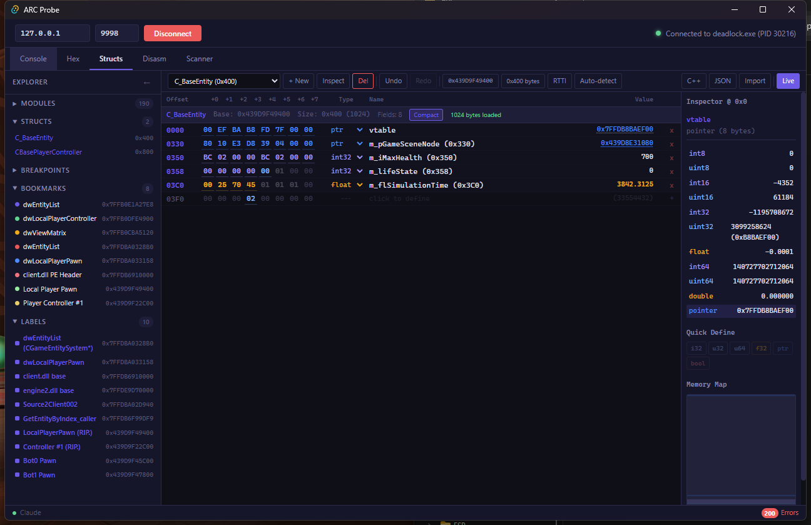
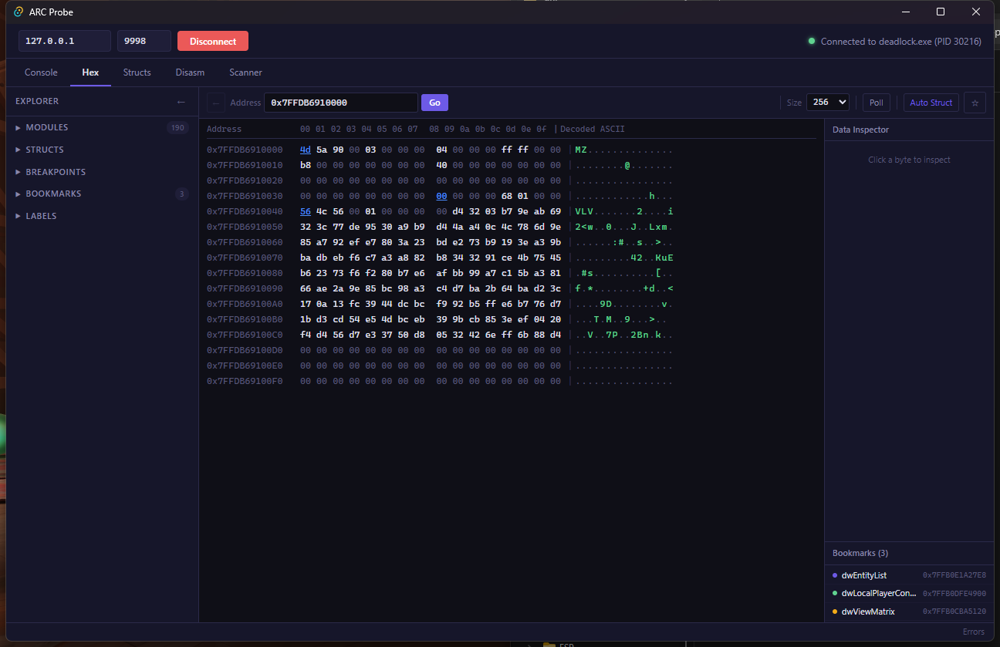
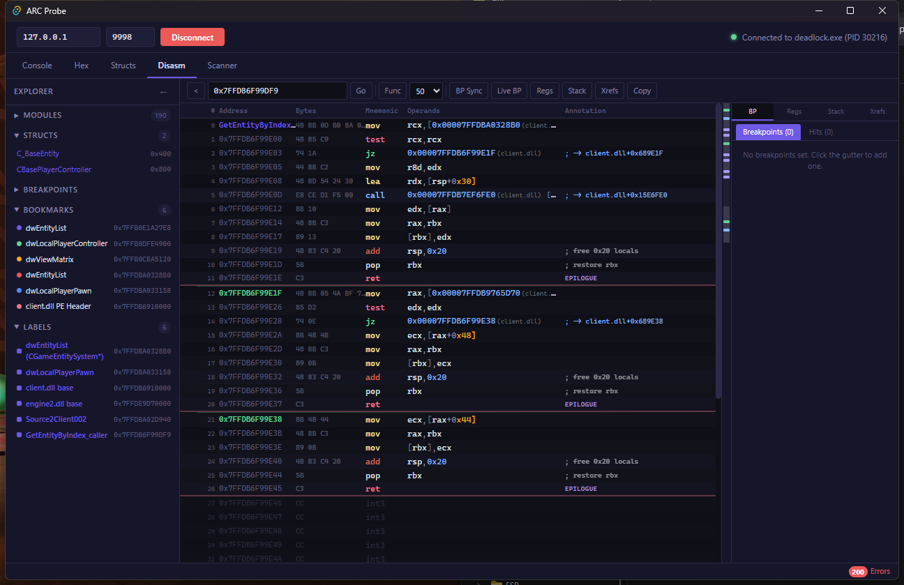

# arc probe

if cheat engine and claude had a baby.

arc probe is a **real-time process memory inspector built for AI agents**. inject a DLL into any Windows x64 process, then read memory, disassemble x86-64, scan patterns, set breakpoints, resolve RTTI — all through **structured JSON over TCP**.

the GUI exists to show the human what the AI is doing. a human can drive it. claude can drive it. or both can work together.

- **65 commands** over TCP — memory read/write, disassembly, RTTI, pattern scan, breakpoints, hooks, threads
- **agent-first design** — Claude Bridge API lets AI control the GUI programmatically
- **struct editor** with live memory values and recursive pointer drill-down
- **works with any x64 process** — no game-specific code required

```bash
# inject into a running process
probe-inject.exe --pid 1234

# read an integer from memory
probe.exe "read_int client.dll+0x354"

# find a C++ class by RTTI
probe.exe "rtti find CitadelPlayerPawn client.dll"

# pattern scan with wildcard bytes and auto-resolve
probe.exe "pattern 48 8B 0D ?? ?? ?? ?? 48 85 C9 client.dll --resolve 3"
```

> **status:** coming soon. the codebase is functional and actively developed — public release is being prepared.

---

## what it looks like

### struct editor — live memory values

define structs from schema dumps or manually, then watch values update in real-time. pointer fields expand inline to show nested structures. the AI builds these programmatically through the Claude Bridge.



### hex viewer

navigate any address in the process. PE headers, entity memory, vtables — click any byte to see every type interpretation in the data inspector. bookmarks and labels for quick navigation.



### disassembler

color-coded x86-64 disassembly with resolved addresses and labels. trace function calls, identify globals via RIP-relative addressing, understand code flow.



### console — structured JSON

every command returns structured JSON. the console renders it with syntax highlighting and collapsible trees. type commands directly or let the AI drive.


### struct hierarchy — full inheritance chain

the AI built 12 struct definitions covering a 14-level C++ inheritance chain — 218 fields total — all from schema dumps + live memory verification. pointer drill-down lets you expand nested structs inline.


---

## how it works

three binaries:

```
probe-shell.dll          probe-inject.exe          probe.exe (CLI)
(inside target process)  (manual-map injector)     (sends commands)
        |                        |                        |
        +-- TCP server ---------|------------------------+
        |   127.0.0.1:9998      |
        +-- Command dispatcher (65 commands)
        +-- Memory engine (SEH-protected reads/writes)
        +-- Zydis x86-64 disassembler
        +-- VEH breakpoint engine (software + hardware)
        +-- RTTI scanner, PE parser
        +-- String scanner, thread inspector
        +-- MinHook function hooking
```

**protocol:** send `command\n` over TCP, receive `{"ok":true,"data":{...}}\n`. all memory access is SEH-wrapped — bad addresses return errors, never crash.

**the GUI** is a Tauri v2 app (Rust backend + React frontend) that connects to the same TCP server. the **Claude Bridge** (`localhost:9996`) accepts JSON POST requests to drive the GUI — create structs, set labels, navigate tabs, read memory — all programmatically.

**the injector** uses manual PE mapping. the DLL doesn't appear in the target's module list.

---

## what the AI can do

arc probe is designed so an AI agent can perform the entire reverse engineering workflow autonomously:

1. **connect** to the target process and enumerate modules
2. **discover all functions** in a module — merging .pdata boundaries, PE exports, and RTTI vtable names
3. **scan cross-references** — find every CALL, JMP, LEA, and MOV that references a given address
4. **discover classes** via RTTI scanning and inheritance resolution
5. **find globals** through pattern scanning with RIP-relative resolution
6. **build struct definitions** from schema dumps, verified against live memory
7. **wire pointer drill-down** between structs for recursive exploration
8. **set breakpoints** to trace what code reads/writes specific addresses
9. **annotate everything** with labels, bookmarks, function names, and comments in the GUI

the human sees every step in the GUI as it happens. both can work simultaneously — the AI automates the tedious memory mapping while you focus on understanding the results.

```bash
# the AI sends this to build a struct via the Claude Bridge
curl -s -X POST http://localhost:9996 -H "Content-Type: application/json" -d '{
  "action": "batch",
  "actions": [
    {"action": "store", "store": "struct", "method": "createStruct",
     "args": ["C_BaseEntity", "0x439D9F49400", 1536]},
    {"action": "store", "store": "struct", "method": "addField",
     "args": ["C_BaseEntity", 852, "int32", "m_iHealth"]},
    {"action": "store", "store": "struct", "method": "addField",
     "args": ["C_BaseEntity", 816, "pointer", "m_pGameSceneNode"]},
    {"action": "navigate", "tab": "structs"}
  ]
}'
```

---

## command reference

### memory

| command | description |
|---------|-------------|
| `read <addr> <size>` | raw bytes (hex), max 4096 |
| `read_ptr <addr>` | 8-byte pointer |
| `read_int <addr>` | 32-bit integer |
| `read_float <addr>` | 32-bit float |
| `read_string <addr>` | null-terminated string |
| `read_chain <addr> <off1> ...` | follow pointer chain |
| `dump <addr> <size>` | hex dump with ASCII |
| `write <addr> <hex>` | write raw bytes |
| `write_int <addr> <val>` | write 32-bit integer |

### search & disassembly

| command | description |
|---------|-------------|
| `pattern <hex> [module]` | IDA-style byte pattern with `??` wildcards |
| `disasm <addr> [count]` | disassemble N instructions |
| `disasm_function <addr>` | disassemble until RET |
| `generate_sig <addr>` | create a byte signature for a function |

### RTTI & modules

| command | description |
|---------|-------------|
| `rtti find <name>` | search for class by partial name |
| `rtti hierarchy <class>` | get inheritance chain |
| `rtti vtable <class>` | vtable address and entries |
| `modules list` | loaded modules with bases |
| `modules info <name>` | detailed module info |
| `pe exports <module>` | exported functions |

### breakpoints

| command | description |
|---------|-------------|
| `bp set <addr>` | software breakpoint (INT3) |
| `hwbp set <addr> <access> <size>` | hardware breakpoint (DR0-DR3) |
| `bp log <id>` | register snapshots from hits |
| `threads stack <tid>` | walk call stack |

[full command reference (65 commands) &rarr;](docs/commands.md)

---

## tutorials

### part 1: getting started

the full walkthrough — from connecting to a live process, through RTTI discovery, pattern scanning, and building 12 annotated struct definitions with 218 fields and recursive pointer drill-down — all driven by Claude as an AI agent.

**[read part 1 &rarr;](docs/tutorial.md)**

### part 2: advanced static analysis

function discovery, cross-reference scanning, RTTI deep dives, vtable disassembly, Source 2 interface enumeration, and the complete agent-driven analysis workflow. 16 screenshots from a live Deadlock session.

**[read part 2 &rarr;](docs/advanced-tutorial.md)**

---

## architecture

```
arc-probe/
├── src/                    # DLL source (injected component)
│   ├── core/               #   memory read/write/scan, hooks
│   ├── server/             #   TCP server, command dispatch, JSON
│   └── commands/           #   65 command implementations
├── cli/                    # probe.exe — CLI client
├── injector/               # probe-inject.exe — manual PE mapper
├── gui/                    # Tauri v2 desktop app
│   ├── src-tauri/src/      #   Rust backend (TCP client, Bridge server)
│   └── src/                #   React frontend (Zustand, Tailwind)
├── mcp/                    # MCP server (Model Context Protocol)
├── plugin/                 # Claude Code plugin with RE skills
├── vendor/                 # Zydis 4.1.1, MinHook
└── demo/                   # Demo target for testing
```

---

## license

coming soon.
