# ARC Probe Advanced Tutorial: Function Discovery, Cross-References, and Static Analysis

This is Part 2 of the ARC Probe tutorial series. The [first tutorial](tutorial.md) covered connecting to a live process, RTTI discovery, hex viewing, and building struct definitions from schema dumps. This tutorial covers the features that transform ARC Probe from a memory inspector into a static analysis platform: **function databases, cross-reference scanning, and deep class hierarchy analysis** -- the features that make IDA Pro users feel at home, built agent-first.

**What changed:** In Part 1, we could find classes and read memory. But we had no function database -- no way to answer "what functions exist in this module?" or "what calls this function?" Now we do. ARC Probe can discover every function boundary in a module, merge names from three data sources, scan for cross-references, and present it all in an IDA-style function list with search, sort, and one-click navigation.

## Prerequisites

- ARC Probe GUI running (`pnpm tauri dev` in `arc-probe/gui/`)
- `probe-shell.dll` injected into the target process
- Target process running (this tutorial uses Deadlock)
- Completed Part 1 or equivalent familiarity with the probe

See [Part 1: Getting Started](tutorial.md) for connection and injection setup.

**Note on addresses:** All addresses in this tutorial are from a specific live session. Due to ASLR (Address Space Layout Randomization), your absolute addresses will differ. RVAs (Relative Virtual Addresses) are stable across sessions for the same binary version. When following along, use `modules info <module>` to get your session's base addresses.

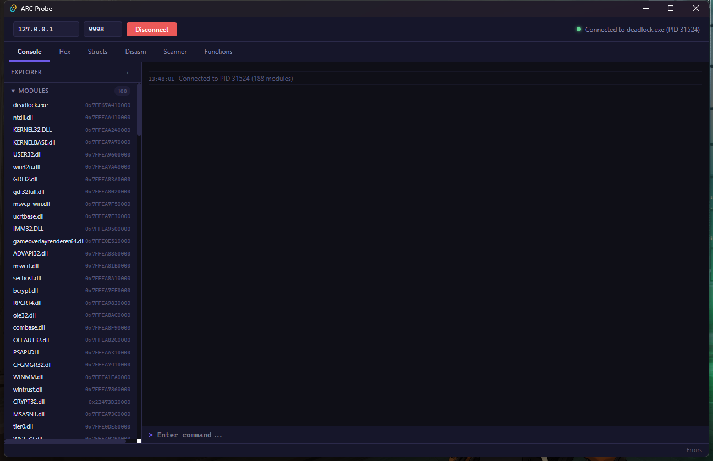

---

## Part 1: Function Discovery -- Mapping the Unknown

In Part 1, we discovered classes via RTTI and fields via schema dumps. But the code itself -- the actual functions that implement game logic -- remained opaque. We could disassemble at a known address, but had no map of what functions exist, where they start and end, or what they are called.

The function discovery system solves this by merging three authoritative data sources into a unified function database.

### The `.pdata` Section -- Authoritative Function Boundaries

Every x64 Windows binary contains a `.pdata` section (formally `IMAGE_DIRECTORY_ENTRY_EXCEPTION`) that lists every function with structured exception handling support. On x64, that means essentially **every function** -- the compiler emits a `RUNTIME_FUNCTION` entry for each one.

Each entry is 12 bytes:

| Field | Size | Description |
|-------|------|-------------|
| `BeginAddress` | 4 bytes | RVA of function start |
| `EndAddress` | 4 bytes | RVA of function end |
| `UnwindInfoAddress` | 4 bytes | RVA of unwind data |

This gives us something that PE exports alone cannot: **function size**. An export tells you where a function starts; `.pdata` tells you where it ends.

#### The `pe exceptions` Command

```
pe exceptions engine2.dll --limit 20
```

```json
{
  "ok": true,
  "data": {
    "module": "engine2.dll",
    "count": 20,
    "total": 46591,
    "functions": [
      {
        "begin_rva": "0x1010",
        "end_rva": "0x108C",
        "begin": "0x7FFDE9D71010",
        "end": "0x7FFDE9D7108C",
        "size": 124
      },
      {
        "begin_rva": "0x1090",
        "end_rva": "0x10B4",
        "begin": "0x7FFDE9D71090",
        "end": "0x7FFDE9D710B4",
        "size": 36
      }
    ]
  }
}
```

**46,591 functions** in engine2.dll alone. Every one with a precise start address, end address, and byte size. This is the foundation that makes everything else possible -- xref scanning needs function boundaries to report "this reference is inside function X," and the function list needs sizes for the size column.

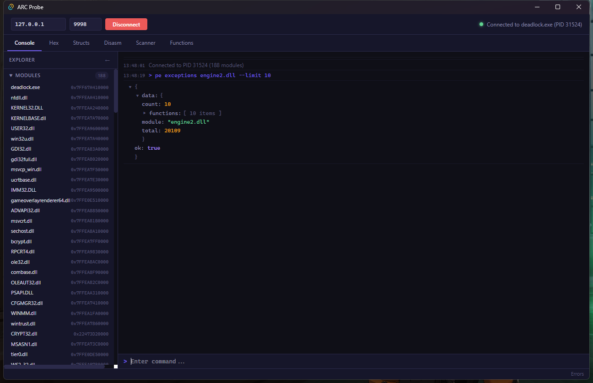

Via the Claude Bridge:

```bash
curl -s -X POST http://localhost:9996 -H "Content-Type: application/json" \
  -d '{"action":"probe","command":"pe exceptions engine2.dll --limit 20"}'
```

### The `functions discover` Command

Raw `.pdata` gives us boundaries but no names. PE exports give us names but only for exported symbols. RTTI vtable entries give us class-associated names but only for virtual functions. The `functions discover` command merges all three:

```
functions discover engine2.dll --exports
```

```json
{
  "ok": true,
  "data": {
    "module": "engine2.dll",
    "base": "0x7FFDE9D70000",
    "count": 46591,
    "total": 46591,
    "functions": [
      {
        "address": "0x7FFDE9D71010",
        "rva": "0x1010",
        "source": "pdata",
        "size": 124
      },
      {
        "address": "0x7FFDEA0D4350",
        "rva": "0x364350",
        "source": "export",
        "name": "CreateInterface",
        "size": 42
      },
      {
        "address": "0x7FFDE9E15A80",
        "rva": "0xA5A80",
        "source": "rtti",
        "name": "CNetworkSystem::vf0",
        "size": 87
      }
    ]
  }
}
```

**Name priority:** export > RTTI vtable > unnamed. If a function address has a PE export name, that wins. If it matches an RTTI vtable entry, the class name is used (e.g., `CNetworkSystem::vf0`). Otherwise it appears as unnamed (displayed as `sub_<RVA>` in the GUI, following IDA convention).

**Source flags** let you control what gets merged:

| Flag | Source | What it provides |
|------|--------|------------------|
| `--pdata` | .pdata section | Function boundaries and sizes |
| `--exports` | PE export table | Symbol names for exported functions |
| `--rtti` | RTTI vtable scan | Class names for virtual function entries |

With no flags, all three sources are enabled. Use `--limit N` to cap the result count (default: 5000).

#### Smaller Modules First

For a quick demonstration, try a smaller module like `tier0.dll`:

```
functions discover tier0.dll --exports --limit 50
```

tier0.dll is the lowest-level Source 2 module (memory allocation, logging, the CVar system). It has many named exports, making it a good target for verifying that discovery works correctly. You will see familiar names like `Msg`, `Warning`, `DevMsg`, `ConVar_Register`, and the `VEngineCvar007` interface entry points.

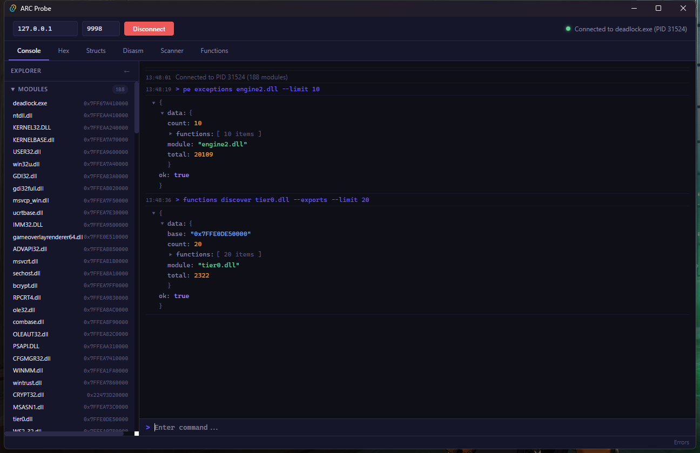

For massive modules like `client.dll` (~60MB, 100,000+ .pdata entries), discovery takes a few seconds. The RTTI vtable scan is the expensive part -- it walks the entire module memory looking for `CompleteObjectLocator` structures and then scans `.rdata` for vtable pointers. Use `--exports --pdata` (skip RTTI) for faster results when you only need export names and function boundaries.

### The Functions Tab in the GUI

The Functions tab provides an IDA-style function list. Click **Discover** to populate it for the selected module.

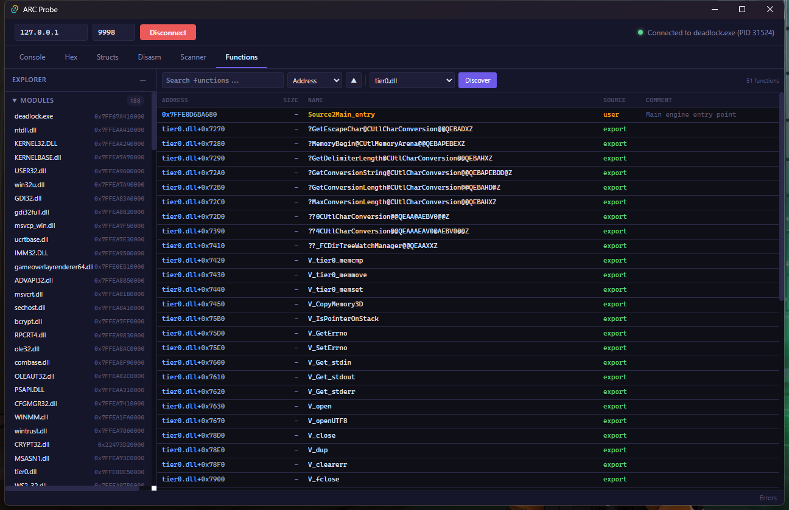

The toolbar provides:

- **Search bar** -- filter by name, address, RVA, or module (instant, client-side)
- **Sort selector** -- sort by Address, Name, Size, or Source
- **Sort order toggle** -- ascending or descending
- **Module selector** -- pick which loaded module to discover
- **Discover button** -- runs `functions discover` and merges results into the database

Each row shows:

| Column | Content | Example |
|--------|---------|---------|
| Address | Module-relative address | `engine2.dll+0x364350` |
| Size | Function size in bytes (from .pdata) | `42` |
| Name | Best available name or `sub_<RVA>` | `CreateInterface` |
| Source | Where the name came from | `export` |
| Comment | User-added annotation | (empty by default) |

**Color coding by source:**

| Source | Color | Meaning |
|--------|-------|---------|
| export | Green | PE export -- compiler-assigned name |
| rtti | Purple | RTTI vtable entry -- class::vfunc name |
| pdata | Gray | Unnamed function -- only boundaries known |
| user | Amber | User-renamed -- manually set via right-click |

**Click** any row to jump to that address in the Disassembly tab. The function store persists to localStorage, so your discovered functions survive page reloads.

#### Right-Click Context Menu

Right-click a function row to access:

- **Rename function...** -- assign a custom name (source changes to "user", shown in amber)
- **Add comment...** -- attach a note to the function
- **Copy address** -- copy the hex address to clipboard
- **Go to disassembly** -- switch to the Disasm tab at this address
- **Find xrefs** -- navigate to the function in disassembly and scan for cross-references

<!-- Context menu screenshot omitted — right-click any function row to see Rename, Comment, Copy, Disasm, Xrefs options -->

User-set names take priority and are never overwritten by subsequent discoveries. This means you can discover a module, rename interesting functions, then re-discover later (after a game update) without losing your annotations.

#### Claude Bridge: Discovering Functions Programmatically

```bash
# Discover functions in engine2.dll
curl -s -X POST http://localhost:9996 -H "Content-Type: application/json" \
  -d '{"action":"store","store":"functions","method":"discoverFunctions","args":["engine2.dll"]}'

# Rename a function
curl -s -X POST http://localhost:9996 -H "Content-Type: application/json" \
  -d '{"action":"store","store":"functions","method":"setFunctionName","args":["0x7FFDEA0D4350","CreateInterface"]}'

# Add a comment
curl -s -X POST http://localhost:9996 -H "Content-Type: application/json" \
  -d '{"action":"store","store":"functions","method":"setFunctionComment","args":["0x7FFDEA0D4350","Source 2 interface factory entry point"]}'

# Navigate to the Functions tab
curl -s -X POST http://localhost:9996 -H "Content-Type: application/json" \
  -d '{"action":"navigate","tab":"functions"}'
```

---

## Part 2: Cross-References -- "Who Calls This?"

This is the feature that transforms a memory inspector into a real reverse engineering tool. Cross-references answer the most important question in reverse engineering: **given a function or address, what other code references it?**

In IDA Pro, pressing `x` on a function shows all callers. ARC Probe's `xref scan` command does the same thing -- scanning the executable sections of a module for every instruction that targets a given address.

### The `xref scan` Command

```
xref scan <target_addr> <module> [--type CALL,JMP,LEA,MOV] [--callees] [--limit N]
```

The scanner walks every byte of every executable section in the specified module, looking for instructions that resolve to the target address. It recognizes:

| Pattern | Opcode | Instruction Type |
|---------|--------|-----------------|
| `E8 XX XX XX XX` | CALL rel32 | Direct function call |
| `E9 XX XX XX XX` | JMP rel32 | Direct jump |
| `0F 8x XX XX XX XX` | Jcc rel32 | Conditional jump |
| `FF 15 XX XX XX XX` | CALL [RIP+disp32] | Indirect call through pointer |
| `48 8D xx XX XX XX XX` | LEA reg, [RIP+disp32] | Load effective address |
| `48 8B xx XX XX XX XX` | MOV reg, [RIP+disp32] | Load from memory |

For each match, the scanner also looks up the **enclosing function** using the .pdata binary search, so you know not just where the reference is, but which function contains it.

#### Example: Who Calls `CreateInterface`?

First, find the address of `CreateInterface` in client.dll:

```
pe exports client.dll --limit 10
```

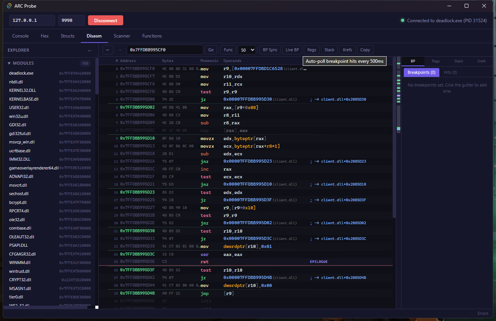

Find the `CreateInterface` export address, then scan for callers:

```
xref scan 0x7FFDB9910000+0x3A56F80 client.dll --type CALL --limit 20
```

```json
{
  "ok": true,
  "data": {
    "mode": "xrefs_to",
    "target": "0x7FFDBCF66F80",
    "module": "client.dll",
    "count": 3,
    "xrefs": [
      {
        "address": "0x7FFDBA123456",
        "type": "CALL",
        "rva": "0x213456",
        "instruction": "call 0x7FFDBCF66F80",
        "function": "0x7FFDBA123400"
      },
      {
        "address": "0x7FFDBA234567",
        "type": "CALL",
        "rva": "0x324567",
        "instruction": "call 0x7FFDBCF66F80",
        "function": "0x7FFDBA234520"
      }
    ]
  }
}
```

Each xref entry includes:

| Field | Description |
|-------|-------------|
| `address` | Where the reference is (absolute) |
| `type` | CALL, JMP, JCC, CALL_IND, LEA, or MOV |
| `rva` | Module-relative offset |
| `instruction` | Disassembled instruction text |
| `function` | Start address of the enclosing function (from .pdata) |

**Type filtering** with `--type` lets you narrow results. Use comma-separated values:

```
# Only direct calls
xref scan 0x7FFDBCF66F80 client.dll --type CALL

# Calls and jumps
xref scan 0x7FFDBCF66F80 client.dll --type CALL,JMP

# Only data references (LEA = address-of, MOV = load)
xref scan 0x7FFDBCF66F80 client.dll --type LEA,MOV
```

### Callees Mode -- "What Does This Function Call?"

The reverse question: given a function, what does it call? The `--callees` flag disassembles the function body and collects all outgoing CALL and JMP targets.

```
xref scan 0x7FFDEA0D4350 engine2.dll --callees
```

```json
{
  "ok": true,
  "data": {
    "mode": "callees",
    "function": "0x7FFDEA0D4350",
    "function_end": "0x7FFDEA0D437A",
    "size": 42,
    "count": 2,
    "callees": [
      {
        "from": "0x7FFDEA0D4360",
        "to": "0x7FFDEA0C1000",
        "type": "CALL",
        "instruction": "call 0x7FFDEA0C1000",
        "callee_function": "0x7FFDEA0C1000"
      },
      {
        "from": "0x7FFDEA0D4370",
        "to": "0x7FFDEA0C2000",
        "type": "JMP",
        "instruction": "jmp 0x7FFDEA0C2000",
        "callee_function": "0x7FFDEA0C2000"
      }
    ]
  }
}
```

Callees mode requires `.pdata` to determine function boundaries. If the target address is not within any `.pdata` entry, the command returns an error. Functions larger than 1MB are rejected as a safety measure.

This is the building block for call graph analysis -- trace callees recursively, and you have a complete call tree.

### The Xref Panel in the Disassembly View

The disassembly viewer has a dedicated **Xrefs** tab in the right panel. Click the **Xrefs** button in the toolbar (or right-click an instruction and select "Find xrefs") to populate it.

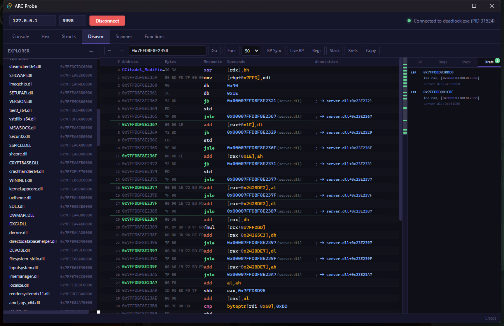

Each xref entry in the panel shows:

- **Type badge** -- color-coded: CALL (blue), JMP/JCC (green), LEA (yellow), MOV (gray)
- **Address** -- clickable, navigates to that instruction
- **Instruction text** -- the actual assembly that references the target
- **Module+offset** -- relative position within the module

The badge count on the "Xrefs" tab shows how many references were found. Click any entry to navigate directly to the referencing instruction -- the disassembler jumps there, and you can trace the code path.

#### Xrefs via the Claude Bridge

```bash
# Find xrefs to an address
curl -s -X POST http://localhost:9996 -H "Content-Type: application/json" \
  -d '{"action":"probe","command":"xref scan 0x7FFDEA0D4350 engine2.dll"}'

# Find callees of a function
curl -s -X POST http://localhost:9996 -H "Content-Type: application/json" \
  -d '{"action":"probe","command":"xref scan 0x7FFDEA0D4350 engine2.dll --callees"}'
```

---

## Part 3: RTTI Deep Dive -- Class Hierarchies and Vtables

Part 1 showed basic `rtti find` and `rtti hierarchy` to discover `C_CitadelPlayerPawn`. This section goes much deeper -- mapping entire subsystems, reading vtable function pointers, and disassembling virtual functions to understand what they do.

### Mapping the Modifier System

Deadlock's buff/debuff/status effect system is built on a modifier hierarchy. Every stun, heal, damage-over-time, ability buff, and item passive implements this interface:

```
rtti hierarchy CCitadel_Modifier_Stunned server.dll
```

```json
{
  "ok": true,
  "data": {
    "class": "CCitadel_Modifier_Stunned",
    "parent": "CCitadelModifier",
    "depth": 6,
    "module": "server.dll",
    "chain": [
      "CCitadel_Modifier_Stunned",
      "CCitadelModifier",
      "CBaseModifier",
      "IModifierFunctionTable",
      "CMemZeroOnNew",
      "CCitadelMovementController"
    ]
  }
}
```

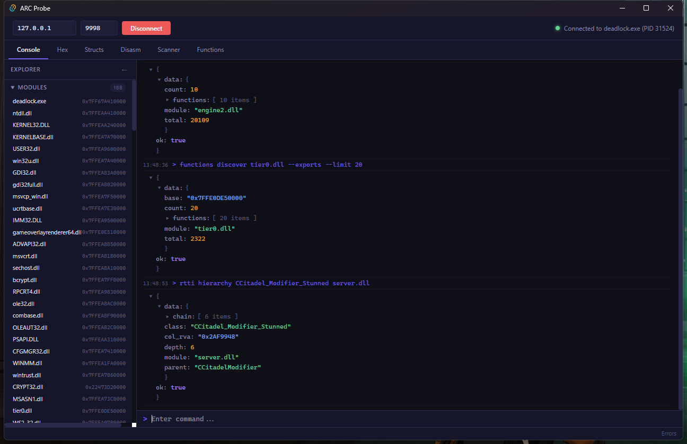

Six levels deep. The inheritance chain reveals the architecture:

| Class | Role |
|-------|------|
| `CCitadel_Modifier_Stunned` | Specific stun implementation |
| `CCitadelModifier` | Deadlock-specific modifier base (hero/item awareness) |
| `CBaseModifier` | Source 2 engine modifier (duration, stacking, networking) |
| `IModifierFunctionTable` | Pure interface -- 50 virtual functions for modifier behaviors |
| `CMemZeroOnNew` | Memory allocator mixin (zero-initialized new) |
| `CCitadelMovementController` | Movement override (stun freezes movement) |

The `IModifierFunctionTable` interface defines 50 overridable behaviors. Every buff, debuff, stun, heal, and DoT in Deadlock implements some subset of these virtual functions. When you see "Stunned" on your screen, the game is calling `CCitadel_Modifier_Stunned::vf7()` (or similar) to check if the stun should apply.

#### Discovering Modifiers via RTTI Search

```
rtti find Modifier client.dll
```

This reveals dozens of modifier classes:

| Class | Purpose |
|-------|---------|
| `CCitadel_Modifier_Stunned` | Stun -- prevents all action |
| `CCitadel_Modifier_Parry` | Melee parry deflection |
| `CCitadel_Modifier_CritShot` | Critical hit damage buff |
| `CCitadel_Modifier_APRounds` | Armor-piercing bullet modifier |
| `CCitadel_Modifier_VeilWalker` | Invisibility item effect |
| `CCitadel_Modifier_MedicBullets` | Healing bullet passive |
| `CCitadel_Modifier_SplitShot` | Multi-projectile modifier |
| `CCitadel_Modifier_QuickSilverReload` | Fast reload buff |
| `CCitadel_Modifier_BloodlettingDebuff` | Bleed damage over time |

Each one follows the same hierarchy pattern. Understanding the modifier system means understanding how every item and ability in the game applies its effects.

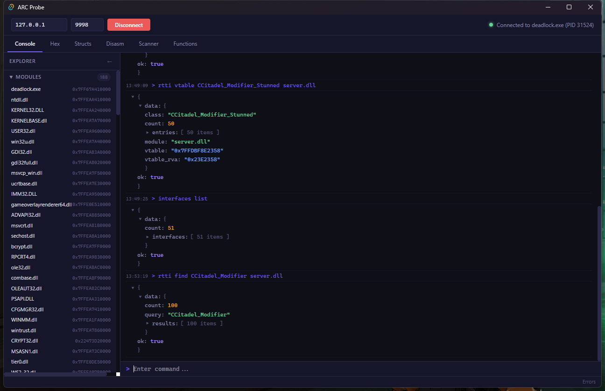

### The Game Rules -- CCitadelGameRules

The match logic itself is governed by a deep hierarchy:

```
rtti hierarchy CCitadelGameRules server.dll
```

```json
{
  "ok": true,
  "data": {
    "class": "CCitadelGameRules",
    "parent": "CTeamplayRules",
    "depth": 7,
    "chain": [
      "CCitadelGameRules",
      "CTeamplayRules",
      "CMultiplayRules",
      "CGameRules",
      "CMemZeroOnNew",
      "CGameEventListener",
      "IGameEventListener2"
    ]
  }
}
```

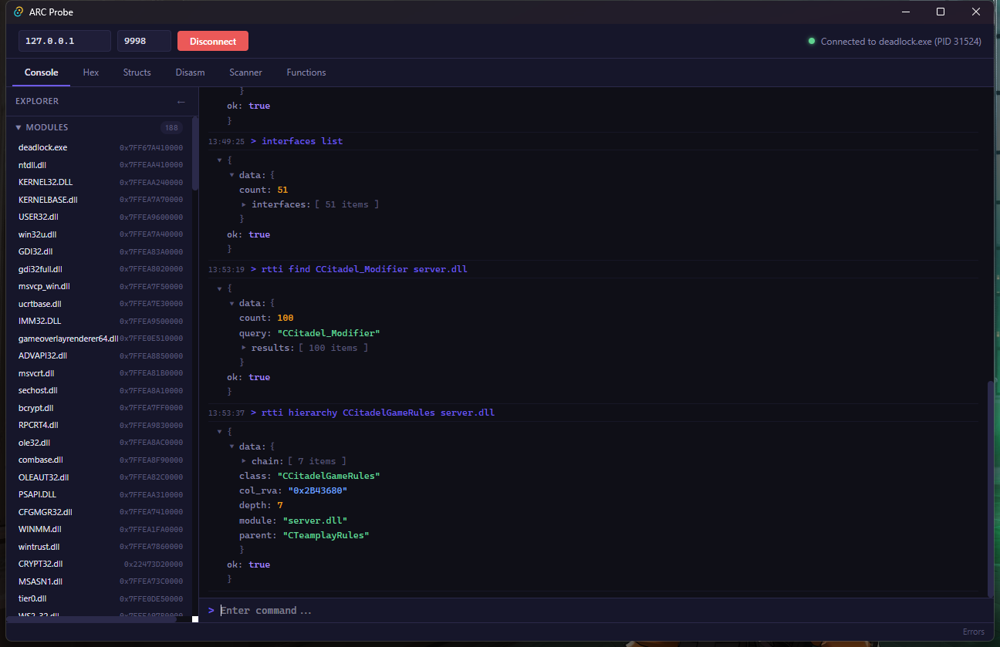

Seven levels deep. `CCitadelGameRules` inherits `CTeamplayRules` (team scoring, round logic), `CMultiplayRules` (multiplayer session management), and `CGameRules` (base rules interface). It also implements `IGameEventListener2` -- meaning the game rules object listens for and reacts to game events (kills, objective captures, soul deposits).

#### Vtable Dump

```
rtti vtable CCitadelGameRules server.dll --count 50
```

```json
{
  "ok": true,
  "data": {
    "class": "CCitadelGameRules",
    "module": "server.dll",
    "vtable": "0x7FFDBE890100",
    "vtable_rva": "0x3390100",
    "count": 50,
    "entries": [
      { "index": 0, "address": "0x7FFDBD8A2340", "rva": "0x3A2340" },
      { "index": 1, "address": "0x7FFDBD8A2380", "rva": "0x3A2380" },
      { "index": 2, "address": "0x7FFDBD8A23C0", "rva": "0x3A23C0" }
    ]
  }
}
```

50 virtual functions controlling match flow, scoring, objectives, the soul economy, win conditions, and more. Each vtable entry is a function pointer into the `.text` section.

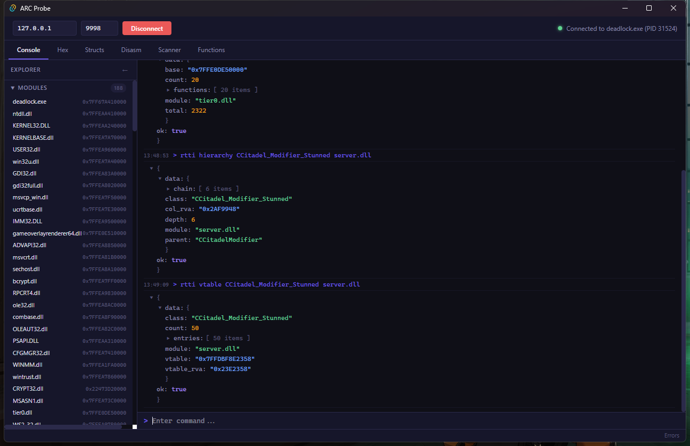

### Vtable Disassembly -- Reading Virtual Functions

Pick any vtable entry and disassemble it to understand what it does. For a class like `CCitadelHeroComponent`, vfunc[0] is typically a small schema registration function:

```
disasm 0x7FFDBD8A2340 15
```

The disassembly reveals a common pattern in Source 2:

```asm
0x7FFDBD8A2340  push rbx                    ; PROLOGUE -- save callee-saved register
0x7FFDBD8A2342  sub rsp, 0x20               ; PROLOGUE -- allocate 32 bytes of stack
0x7FFDBD8A2346  lea rdx, [0x7FFDBE3C5A80]   ; load pointer to class name string
0x7FFDBD8A234D  mov rbx, rcx                ; save 'this' pointer
0x7FFDBD8A2350  call 0x7FFDBD7A1000         ; call schema registration helper
0x7FFDBD8A2355  mov rcx, rbx                ; restore 'this'
0x7FFDBD8A2358  add rsp, 0x20               ; EPILOGUE -- free stack
0x7FFDBD8A235C  pop rbx                     ; EPILOGUE -- restore register
0x7FFDBD8A235D  ret                         ; EPILOGUE -- return
```

Follow the LEA target to find the class name:

```
read_string 0x7FFDBE3C5A80
```

This typically resolves to the class's schema name -- confirming which class this vtable belongs to and what vfunc[0] does (schema type registration).

![Disassembly of HeroComponent::vfunc[0] — schema registration pattern](tutorial-screenshots/advanced-08-disasm-hero-vfunc.png)

**Key patterns to recognize in vtable functions:**

| Pattern | Meaning |
|---------|---------|
| `lea rdx, [rip+...]` then `call` | Passing a string literal (class name, field name) to a registration function |
| `mov eax, <constant>` then `ret` | Constant-return getter (version number, flags) |
| `jmp <addr>` | Thunk -- delegates to another function (often a parent class default) |
| Full prologue + complex body | Real implementation -- worth analyzing |

### The Hero System

The hero component architecture follows Source 2's Entity Component System (ECS) pattern:

```
rtti find CitadelHero client.dll
```

Key classes discovered:

| Class | Module | Purpose |
|-------|--------|---------|
| `CCitadelHeroComponent` | client.dll | Component attached to each player pawn (9 vfuncs) |
| `CCitadelHeroDataSystem` | client.dll | Hero data loading and caching |
| `CCitadelHeroBuildsManager` | client.dll | Item build recommendations |
| `CCitadelHeroLoader` | client.dll | Async hero asset loading |
| `CCitadelHeroCard` | client.dll | UI card for hero selection screen |

`CCitadelHeroComponent` lives at pawn offset `0x1690` (from the schema dump). It is an embedded struct, not a heap-allocated object -- no separate lifetime management. Each pawn has exactly one hero component instance, containing hero-specific state: hero ID, level, abilities, stats.

```
rtti vtable CCitadelHeroComponent client.dll --count 9
```

9 virtual functions: schema registration, component initialization, hero ID queries, and ability slot management. The component pattern means the engine can iterate all components of a given type efficiently -- important for systems that need to process all heroes (respawn timers, XP distribution, etc.).

---

## Part 4: Source 2 Interface Map -- 51 Interfaces

Source 2 engines expose their subsystems through the `CreateInterface` pattern -- a well-known convention where each DLL exports a `CreateInterface` function that returns pointers to versioned interface instances. ARC Probe can enumerate all of these across every loaded module.

### Enumerating All Interfaces

```
interfaces list
```

This walks every loaded module's `CreateInterface` export and follows the linked list of registered interfaces. In a typical Deadlock session, you will find approximately 51 interfaces across 7 modules:

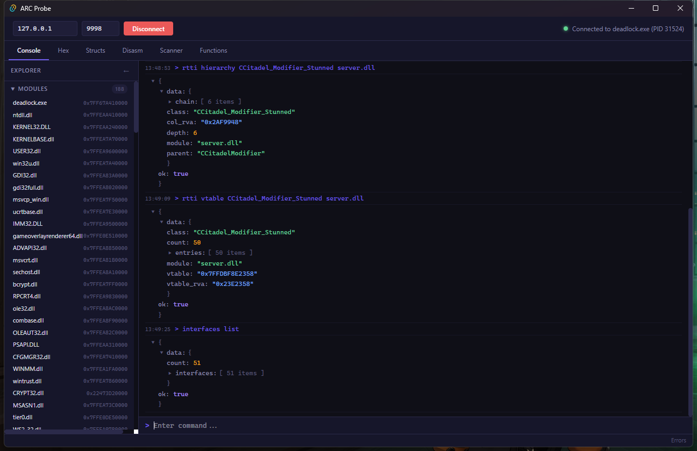

#### Interface Groups

| Module | Count | Key Interfaces |
|--------|-------|----------------|
| client.dll | 6 | `Source2Client002`, `Source2ClientUI001`, `Source2ClientPrediction001`, `ClientToolsInfo_001`, `GameClientExports001`, `Source2ClientConfig001` |
| engine2.dll | 27 | `InputService_001`, `NetworkClientService_001`, `GameResourceServiceClientV001`, `EngineServiceMgr001`, `Source2EngineToClient001`, `SoundService_001`, `RenderService_001` |
| inputsystem.dll | 2 | `InputSystemVersion001`, `InputStackSystemVersion001` |
| materialsystem2.dll | 5 | `VMaterialSystem2_001`, `PostProcessingSystem_001`, `TextureManager_001` |
| particles.dll | 1 | `ParticleSystemMgr003` |
| schemasystem.dll | 1 | `SchemaSystem_001` |
| tier0.dll | 4 | `VEngineCvar007`, `VProcessUtils002`, `VStringTokenSystem001` |

These are the entry points through which the engine's modules communicate. `Source2Client002` is how the engine calls into client.dll for rendering, entity management, and HUD. `VEngineCvar007` is the console variable system. `SchemaSystem_001` manages the runtime type information used by the networking and serialization layers.

### Interface Vtable Inspection

```
interfaces vtable Source2Client002 client.dll
```

This reads the vtable entries for a specific interface, giving you the addresses of all virtual functions. Each entry is a function pointer into the module's `.text` section.

### Automated Interface Analysis

The most powerful interface command is `interfaces dump`, which goes beyond reading vtable entries -- it actually analyzes each function:

```
interfaces dump Source2Client002
```

For each vtable entry, the probe:

1. Reads the function pointer
2. Reads the first bytes of the function
3. Classifies the function as one of:
   - **stub** -- immediate return (`ret` or `xor eax, eax; ret`)
   - **thunk** -- single jump to another function (`jmp <addr>`)
   - **constant-return** -- loads a value and returns (`mov eax, N; ret`)
   - **needs-args** -- real function that requires arguments
   - **crashed** -- function pointer was invalid

This is automated reverse engineering. Without any human intervention, the probe can tell you which interface functions are implemented (needs-args), which are stubs (not yet used), and which return constant values (version numbers, capability flags).

Example output:

```
vfunc[0]: needs-args       ; real implementation
vfunc[1]: thunk -> 0x7FFDB6A12000
vfunc[2]: constant 4       ; returns 4
vfunc[7]: stub             ; empty implementation
vfunc[10]: constant 2      ; returns 2
vfunc[14]: crashed          ; needs specific args, calling it crashed
```

The constant-return functions are especially useful -- they often encode version numbers, feature flags, or capability masks that tell you about the engine's configuration.

---

## Part 5: The Game Event System

RTTI scanning reveals the complete event architecture:

```
rtti find GameEvent client.dll
```

### Event Pipeline

```
IGameEventListener2 --> CGameEventListener --> CGameEventDispatcher --> CGameEventSystem
```

| Class | Role |
|-------|------|
| `IGameEventListener2` | Pure interface -- `FireGameEvent(IGameEvent*)` |
| `CGameEventListener` | Base class for event listeners (auto-registration) |
| `CGameEventDispatcher` | Routes events to registered listeners |
| `CGameEventSystem` | Top-level system -- creates, dispatches, serializes events |

The tiered app system hierarchy is also visible via RTTI:

```
rtti find AppSystem client.dll
```

This reveals the Source 2 application system tiers: `CTier0AppSystem`, `CTier1AppSystem`, `CTier2AppSystem`, `CTier3AppSystem`, `CTier4AppSystem`. Each tier adds dependencies -- Tier0 is standalone (memory, logging), Tier1 adds CVars, Tier2 adds rendering, and so on. Every engine subsystem inherits from one of these tiers, determining its initialization order and available services.

---

## Part 6: Network Messages and the Wire Protocol

The RTTI scan of engine2.dll reveals the complete Source 2 network protocol:

```
rtti find SVCMsg client.dll
rtti find CLCMsg client.dll
rtti find NETMsg client.dll
```

### Core Network Messages

| Message Class | Direction | Purpose |
|---------------|-----------|---------|
| `CSVCMsg_PacketEntities` | S->C | Entity state updates (the core of netcode) |
| `CSVCMsg_FlattenedSerializerWrapper` | S->C | Schema serialization metadata |
| `CSVCMsg_ServerInfo` | S->C | Server configuration, map, tick rate |
| `CSVCMsg_CreateStringTable` | S->C | Network string table creation |
| `CSVCMsg_UpdateStringTable` | S->C | String table updates |
| `CSVCMsg_ClassInfo` | S->C | Entity class definitions |
| `CCLCMsg_BaselineAck` | C->S | Entity baseline acknowledgment |
| `CCLCMsg_Move` | C->S | Player movement commands (UserCmd) |
| `CNETMsg_Tick` | Both | Tick synchronization |
| `CNETMsg_SpawnGroup_Load` | S->C | Map streaming -- load a spawn group |
| `CNETMsg_SpawnGroup_Unload` | S->C | Map streaming -- unload a spawn group |

### Connection Handshake

```
rtti find C2S_CONNECT client.dll
```

| Message | Purpose |
|---------|---------|
| `C2S_CONNECTION_Message` | Initial connection request |
| `C2S_CONNECT_Message` | Full connection with auth token |
| `S2C_CHALLENGE_Message` | Server challenge (anti-spoof) |
| `S2C_CONNECTION_Message` | Connection accepted |

This is the same protocol used by CS2 -- Source 2 shares its networking layer across all titles. Understanding these messages is the foundation for replay parsing, spectator clients, and network analysis tools.

### Game Event Messages

```
rtti find GameEvent client.dll
```

| Class | Purpose |
|-------|---------|
| `CSVCMsg_GameEvent` | Serialized game event over the wire |
| `CSVCMsg_GameEventList` | Event type definitions (name -> ID mapping) |
| `CBidirMsg_RebroadcastGameEvent` | Spectator/GOTV event forwarding |

Events like "player_death", "objective_captured", "soul_deposited" are serialized as `CSVCMsg_GameEvent` and dispatched through the `CGameEventSystem`. The `GameEventList` message at connection time tells the client what event IDs map to what names.

---

## Part 7: Matchmaking and Economy (Steam Integration)

RTTI scanning of `steamclient64.dll` reveals Valve's protobuf-based Steam backend API:

```
rtti find QueuedMatchmaking steamclient64.dll
rtti find Inventory steamclient64.dll
```

### Matchmaking

| Class | Purpose |
|-------|---------|
| `CQueuedMatchmaking_SearchForGame_Request` | Client queues for a match |
| `CQueuedMatchmaking_SearchForGame_Response` | Server responds with queue status |
| `CQueuedMatchmakingGameHost_SearchForPlayers_Request` | Game server requests players |
| `CQueuedMatchmakingGameHost_SubmitPlayerResult_Request` | Post-match MMR update |
| `CQueuedMatchmakingGameHost_EndGame_Request` | Match finalization |

### Economy

| Class | Purpose |
|-------|---------|
| `CInventory_PurchaseInit_Request` | Begin a microtransaction |
| `CInventory_PurchaseFinalize_Request` | Complete the purchase |
| `CClientInventory` | Local inventory cache |

These are full protobuf message classes. Their field layouts can be extracted via RTTI vtable analysis (the serialization vfuncs reveal field descriptors). This is how every Valve game talks to the Steam backend -- Deadlock, CS2, Dota 2, all share this infrastructure.

---

## Part 8: Navigation and Workflow

### Back/Forward Navigation

The disassembly viewer maintains a full navigation history, like a web browser. When you follow a CALL target (double-click or click `[follow]`), the current address is pushed onto the history stack.

- **Alt+Left** or the Back button: return to the previous address
- **Alt+Right** or the Forward button: go forward again
- History stores up to 20 entries

This is essential when tracing call chains: follow a call, look at the target, go back, follow the next call, and so on. The history stack makes this workflow fluid rather than requiring you to manually track addresses.

### Labels and Comments

The label system provides persistent address annotations. Double-click the address column in any disassembly row to add or edit a label. Labels are shown in amber in the address column and also appear as annotations on CALL/JMP targets:

```asm
0x7FFDEA0D4350  call 0x7FFDEA0C1000        ; -> CreateInterface
```

When a label exists at a CALL target, the annotation column shows `; -> LabelName` in amber. This transforms raw disassembly into readable code -- you can label important functions once and see their names everywhere they are called.

The comment system (separate from labels) is available on the function store. Comments are shown in the Functions tab's Comment column and are useful for recording what you have learned about a function.

#### Labels via Claude Bridge

```bash
# Set a label
curl -s -X POST http://localhost:9996 -H "Content-Type: application/json" \
  -d '{"action":"store","store":"label","method":"setLabel","args":["0x7FFDEA0D4350","CreateInterface"]}'

# Set a label with comment
curl -s -X POST http://localhost:9996 -H "Content-Type: application/json" \
  -d '{"action":"store","store":"label","method":"setLabelComment","args":["0x7FFDEA0D4350","Source 2 interface factory -- returns interface pointer by version string"]}'
```

### Function-to-Label Synchronization

When you rename a function in the Functions tab, the function store updates. The label store can also be used independently. For a complete workflow, set both:

```bash
curl -s -X POST http://localhost:9996 -H "Content-Type: application/json" -d '{
  "action":"batch","actions":[
    {"action":"store","store":"functions","method":"setFunctionName","args":["0x7FFDEA0D4350","CreateInterface"]},
    {"action":"store","store":"label","method":"setLabel","args":["0x7FFDEA0D4350","CreateInterface"]}
  ]
}'
```

Now the function appears by name in the Functions tab, and every CALL to that address in the disassembly shows the name as an annotation.

---

## Part 9: Putting It All Together -- A Full Analysis Session

Let's walk through a real reverse engineering scenario: **Find what happens when a player gets stunned in Deadlock.**

### Step 1: Find the Class

```
rtti find Modifier_Stunned server.dll
```

We find `CCitadel_Modifier_Stunned` among the results. The server module contains the authoritative game logic.

### Step 2: Map the Inheritance Chain

```
rtti hierarchy CCitadel_Modifier_Stunned server.dll
```

Result: 6-level chain from `CCitadel_Modifier_Stunned` down through `CCitadelModifier`, `CBaseModifier`, `IModifierFunctionTable`, `CMemZeroOnNew`, and `CCitadelMovementController`.

This tells us:
- The stun modifier inherits movement control (`CCitadelMovementController`) -- it can freeze the player
- It implements `IModifierFunctionTable` -- 50 overridable behavior hooks
- It uses `CMemZeroOnNew` -- zero-initialized allocation (common Source 2 pattern)

### Step 3: Examine the Vtable

```
rtti vtable CCitadel_Modifier_Stunned server.dll --count 50
```

50 virtual function entries. Each is a pointer to a function in server.dll's `.text` section.


### Step 4: Disassemble Key Virtual Functions

Pick a vtable entry and disassemble it:

```
disasm <vfunc_7_address> 30
```

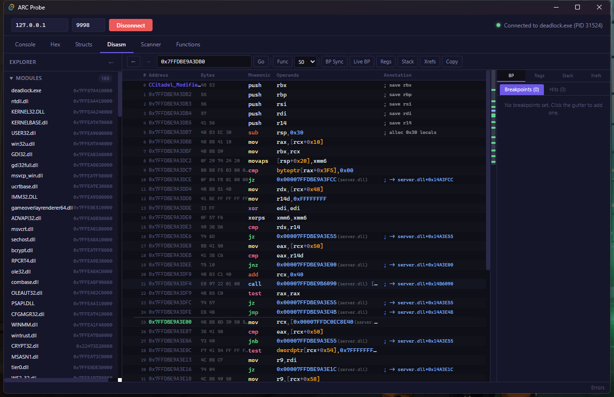

Look for patterns:
- **Entity handle resolution**: `mov eax, [rcx+0x6BC]` followed by `and eax, 0x7FFF` -- resolving `m_hPawn`
- **Team checks**: `movzx eax, byte ptr [rcx+0x3F3]` -- reading `m_iTeamNum`
- **Health modification**: `mov [rcx+0x354], eax` -- writing `m_iHealth`
- **Time checks**: `comiss xmm0, [rcx+0x3C0]` -- comparing against `m_flSimulationTime`

### Step 5: Follow Internal Calls

When the disassembly shows a `call` instruction, follow it:

```
disasm <call_target> 20
```

This leads to helper functions -- common modifier utilities shared across all modifier types. Label them as you discover their purpose:

```bash
curl -s -X POST http://localhost:9996 -H "Content-Type: application/json" \
  -d '{"action":"store","store":"label","method":"setLabel","args":["0x7FFDBE456090","Modifier::ApplyEffect"]}'
```

### Step 6: Find Who Creates the Stun

Use xref scanning to find what code creates `CCitadel_Modifier_Stunned`:

```
xref scan <stun_vtable_addr> server.dll --type LEA,MOV
```

LEA references to the vtable are how modifiers get constructed -- the constructor writes the vtable pointer to the object. Finding these references leads you to the functions that create and apply stun modifiers, which tells you what abilities cause stuns.

### Step 7: Label Everything

As you discover functions, label them:

```bash
curl -s -X POST http://localhost:9996 -H "Content-Type: application/json" -d '{
  "action":"batch","actions":[
    {"action":"store","store":"label","method":"setLabel","args":["0x7FFDBE450000","CCitadel_Modifier_Stunned::OnApply"]},
    {"action":"store","store":"label","method":"setLabel","args":["0x7FFDBE450100","CCitadel_Modifier_Stunned::OnRemove"]},
    {"action":"store","store":"label","method":"setLabel","args":["0x7FFDBE456090","Modifier::ApplyEffect_Helper"]},
    {"action":"store","store":"functions","method":"setFunctionName","args":["0x7FFDBE450000","CCitadel_Modifier_Stunned::OnApply"]},
    {"action":"store","store":"functions","method":"setFunctionName","args":["0x7FFDBE450100","CCitadel_Modifier_Stunned::OnRemove"]},
    {"action":"store","store":"functions","method":"setFunctionComment","args":["0x7FFDBE450000","Called when stun is first applied to an entity. Disables movement, sets stun animation."]}
  ]
}'
```

### Step 8: Build the Modifier Struct

Use the struct editor to map the `CCitadel_Modifier_Stunned` object layout. The first 8 bytes are the vtable pointer, followed by modifier state fields (duration, stacking count, caster handle, target handle, etc.):

```bash
curl -s -X POST http://localhost:9996 -H "Content-Type: application/json" -d '{
  "action":"batch","actions":[
    {"action":"store","store":"struct","method":"createStruct","args":["CCitadel_Modifier_Stunned","0x0",256]},
    {"action":"store","store":"struct","method":"addField","args":["CCitadel_Modifier_Stunned",0,"pointer","vtable"]},
    {"action":"store","store":"struct","method":"addField","args":["CCitadel_Modifier_Stunned",8,"uint32","m_hCaster"]},
    {"action":"store","store":"struct","method":"addField","args":["CCitadel_Modifier_Stunned",12,"uint32","m_hTarget"]},
    {"action":"store","store":"struct","method":"addField","args":["CCitadel_Modifier_Stunned",16,"float","m_flDuration"]},
    {"action":"store","store":"struct","method":"addField","args":["CCitadel_Modifier_Stunned",20,"float","m_flStartTime"]},
    {"action":"store","store":"struct","method":"addField","args":["CCitadel_Modifier_Stunned",24,"int32","m_nStackCount"]},
    {"action":"navigate","tab":"structs"}
  ]
}'
```

The struct view shows live values if you have an actual stunned entity address, confirming field offsets as you go.

### The Complete Picture

Starting from a single RTTI search, we:

1. Found the stun modifier class and its 6-level inheritance chain
2. Mapped 50 virtual functions in the vtable
3. Disassembled key vfuncs to understand the stun logic
4. Traced helper functions via call following
5. Found what abilities create stuns via xref scanning
6. Labeled 6 functions with meaningful names
7. Built a struct definition for the modifier object

This is the workflow that the advanced features enable. Function discovery gives you the map. Cross-references give you the connections. RTTI gives you the types. Labels give you persistence. Together, they turn a 60MB binary into a navigable, annotated codebase.

---

## Part 10: The Complete Claude Bridge Workflow

For AI agents driving ARC Probe, here is a complete analysis workflow using the Claude Bridge:

### Step 1: Discover Functions

```bash
curl -s -X POST http://localhost:9996 -H "Content-Type: application/json" \
  -d '{"action":"store","store":"functions","method":"discoverFunctions","args":["server.dll"]}'
```

### Step 2: Search for Interesting Functions

After discovery, the function store contains all functions. Filter in the GUI or query via the probe:

```bash
curl -s -X POST http://localhost:9996 -H "Content-Type: application/json" \
  -d '{"action":"probe","command":"pe exports server.dll --limit 50"}'
```

### Step 3: Label Key Functions

```bash
curl -s -X POST http://localhost:9996 -H "Content-Type: application/json" -d '{
  "action":"batch","actions":[
    {"action":"store","store":"functions","method":"setFunctionName","args":["0x7FFDBE000000","ServerInit"]},
    {"action":"store","store":"label","method":"setLabel","args":["0x7FFDBE000000","ServerInit"]},
    {"action":"activity","status":"working","message":"Labeling server functions..."}
  ]
}'
```

### Step 4: Trace Call Chains

```bash
# Find what calls ServerInit
curl -s -X POST http://localhost:9996 -H "Content-Type: application/json" \
  -d '{"action":"probe","command":"xref scan 0x7FFDBE000000 server.dll --type CALL"}'

# Find what ServerInit calls
curl -s -X POST http://localhost:9996 -H "Content-Type: application/json" \
  -d '{"action":"probe","command":"xref scan 0x7FFDBE000000 server.dll --callees"}'
```

### Step 5: Build Structs from Discovered Data

```bash
curl -s -X POST http://localhost:9996 -H "Content-Type: application/json" -d '{
  "action":"batch","actions":[
    {"action":"store","store":"struct","method":"createStruct","args":["DiscoveredStruct","0x7FFDBE100000",128]},
    {"action":"store","store":"struct","method":"addField","args":["DiscoveredStruct",0,"pointer","vtable"]},
    {"action":"store","store":"struct","method":"addField","args":["DiscoveredStruct",8,"int32","field_8"]},
    {"action":"navigate","tab":"structs"},
    {"action":"activity","status":"idle","message":"Analysis complete"}
  ]
}'
```

### Step 6: Navigate and Verify

```bash
# Jump to disassembly at a specific address
curl -s -X POST http://localhost:9996 -H "Content-Type: application/json" \
  -d '{"action":"navigate","tab":"disasm","address":"0x7FFDBE000000"}'

# Jump to hex view
curl -s -X POST http://localhost:9996 -H "Content-Type: application/json" \
  -d '{"action":"navigate","tab":"hex","address":"0x7FFDBE100000"}'
```

The entire workflow -- discovery, labeling, xref tracing, struct building, navigation -- can be driven programmatically through the bridge. An AI agent can analyze a binary without any human clicking.

---

## Summary: What the Advanced Features Enable

| Feature | Part 1 (Tutorial) | Part 2 (This Tutorial) |
|---------|-------------------|----------------------|
| **Functions** | Disassemble at known addresses | Discover ALL functions, search, sort, rename, persist |
| **Cross-references** | Manual disassembly tracing | Automated xref scanning -- find all callers/callees |
| **RTTI** | Basic class name + hierarchy | Deep vtable analysis, modifier systems, game rules |
| **Interfaces** | `interfaces list` | Automated vtable probing, function classification |
| **Navigation** | Follow address manually | Back/forward history, function-to-disasm click-through |
| **Annotations** | Labels and bookmarks | Function names, comments, per-address annotations |
| **Agent workflow** | Build structs from schema | Full analysis pipeline: discover -> label -> xref -> struct |

The trajectory is clear: ARC Probe started as a memory inspector (read bytes, dump hex). Part 1 added structure (structs, RTTI, entities). Part 2 adds code analysis (functions, xrefs, static analysis). Each layer builds on the previous one, and each layer works equally well for human users and AI agents.

---

## What's Next

The analysis capabilities covered in this tutorial represent Phase 1 of the static analysis roadmap. Upcoming work includes:

- **Call Graph Visualization** -- trace execution paths as an interactive graph. Follow the call tree from any function and see the full dependency network. The CFG viewer already exists for basic blocks; call graphs extend this to function-level relationships.

- **Command Palette** -- Ctrl+P fuzzy search across all functions, labels, structs, and modules. Type a partial name to jump anywhere instantly, like VS Code's command palette but for reverse engineering.

- **Decompiler Integration** -- automated lifting from disassembly to pseudo-C, using the struct definitions and labels built during analysis to produce readable output.

- **Collaborative Analysis** -- export/import of function databases, labels, and struct definitions between sessions and between analysts. Share your analysis, merge discoveries, build on each other's work.

The foundation is in place. Functions, xrefs, RTTI, interfaces, structs, labels -- these are the primitives that make everything else possible. Every future feature is a composition of these building blocks, and every one works through the same agent-first architecture: CLI, Claude Bridge, and GUI, all operating on the same data.

That is the vision: a reverse engineering platform where human intuition and AI automation are equally capable, equally productive, and better together.
