# ARC Probe Tutorial: AI-Powered Reverse Engineering from Zero

This tutorial walks through a complete reverse engineering session using ARC Probe and Claude as an AI agent — from connecting to a live process, through discovering game structures, to building fully annotated struct definitions with live memory values.

**What makes this different:** ARC Probe is agent-first. The GUI exists to show the human what the AI is doing, so you can work as a collaborative partner. A human can drive it; Claude can drive it; or both can work together. This is collaborative software for the new age of AI-assisted development.

## Prerequisites

- ARC Probe GUI running (`pnpm tauri dev` in `arc-probe/gui/`)
- `probe-shell.dll` injected into the target process
- Target process running (this tutorial uses Deadlock)
- Schema dump from [dezlock-dump](https://github.com/user/dezlock-dump) (optional but powerful)

## Part 1: Connecting to the Target

### Step 1: Launch ARC Probe

Open the ARC Probe GUI. You'll see the connection bar at the top with the default address `127.0.0.1:9998`.

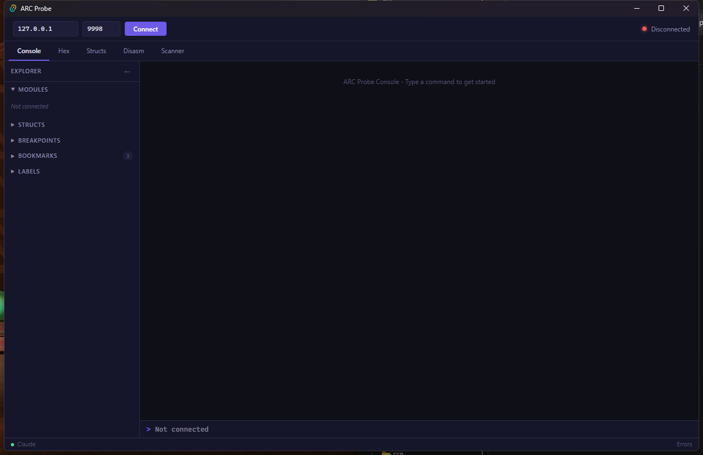

The sidebar shows the Explorer with sections for Modules, Structs, Breakpoints, Bookmarks, and Labels — all empty until we connect.

### Step 2: Connect

Click **Connect**. The probe-shell.dll inside the target process accepts the TCP connection.

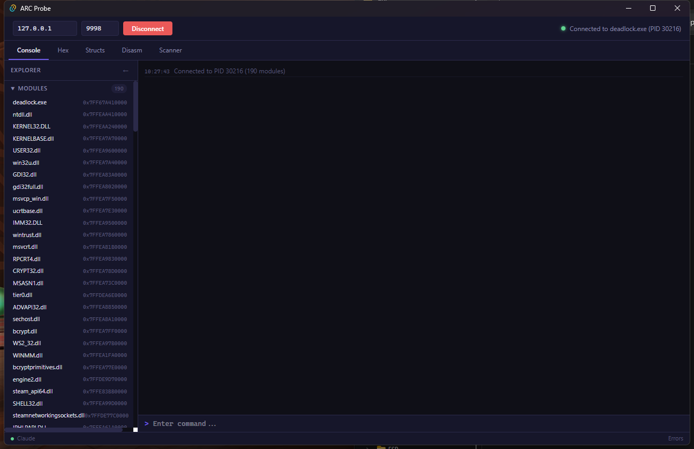

Immediately, the sidebar populates with **190 loaded modules** — every DLL in the target process. The console shows `Connected to PID 30216 (190 modules)`.

### Step 3: Verify with `ping`

Type `ping` in the console to verify the connection is alive.

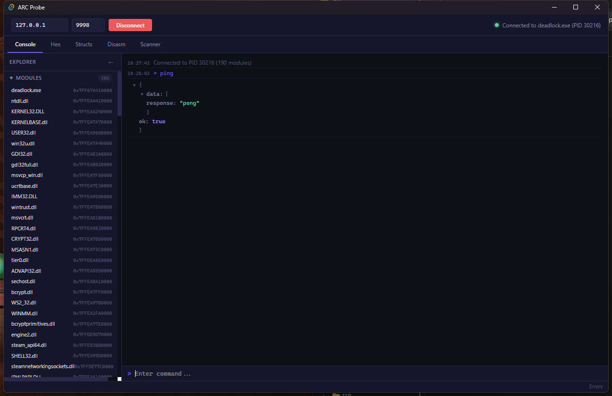

```json
{
  "data": { "response": "pong" },
  "ok": true
}
```

### Step 4: Check Status

Type `status` to see the full process info.

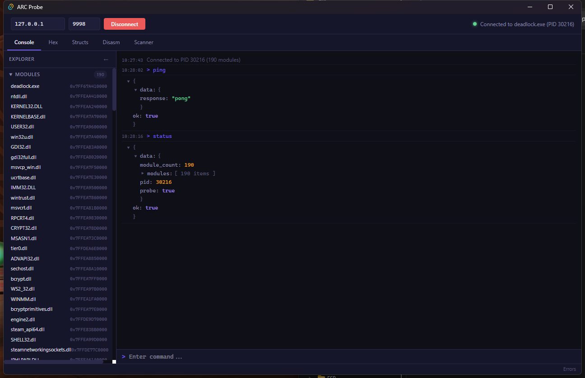

We now know: PID 30216, 190 modules, probe active.

## Part 2: Module Discovery

### Step 5: Inspect client.dll

Type `modules info client.dll` to get details on the main game module.

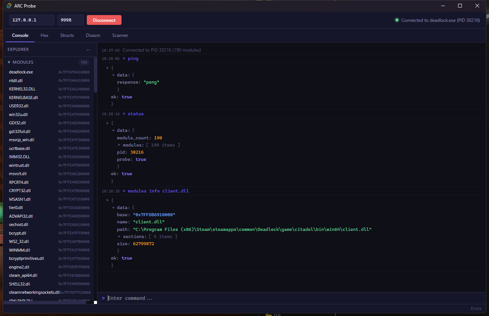

Key info:
- **Base:** `0x7FFDB6910000`
- **Size:** 62,799,872 bytes (~60 MB)
- **Path:** `C:\Program Files (x86)\Steam\steamapps\common\Deadlock\game\citadel\bin\win64\client.dll`
- **5 PE sections** (.text, .rdata, .data, .pdata, .rsrc)

This base address is critical — all offsets in the schema dump are relative to it.

## Part 3: RTTI Discovery — What Classes Exist?

### Step 6: Find Player Classes via RTTI

Instead of scanning the entire 60MB module (which returns thousands of classes), we do a targeted search:

```
rtti find CitadelPlayerPawn client.dll
```

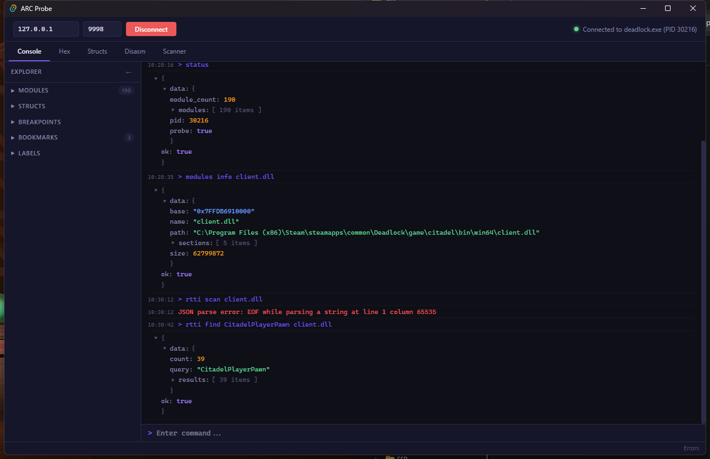

**39 RTTI matches** — including the main class `C_CitadelPlayerPawn` plus template instantiations for network variables, handles, and other infrastructure.

### Step 7: Map the Inheritance Chain

```
rtti hierarchy C_CitadelPlayerPawn client.dll
```

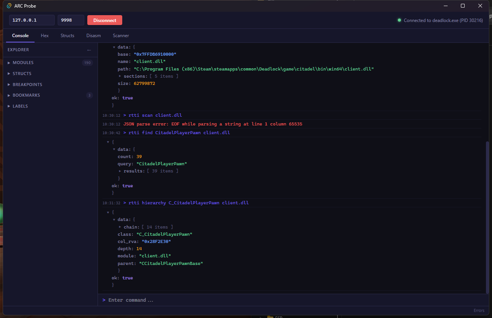

This reveals a **14-level deep** inheritance chain:

```
C_CitadelPlayerPawn
  -> CCitadelPlayerPawnBase
    -> C_BasePlayerPawn
      -> C_BaseCombatCharacter
        -> C_BaseFlex
          -> CBaseAnimGraph
            -> C_BaseModelEntity
              -> C_BaseEntity          <-- health, team, position
                -> CEntityInstance     <-- entity system base
                  -> IBoneTransformOverride
                    -> CGameEventListener
                      -> IGameEventListener2
                        -> IBoneTransformModifier
                          -> CCitadelAudioAnimEventHandler
```

This hierarchy tells us exactly which parent class defines which fields. `m_iHealth` comes from `C_BaseEntity`, position comes from `CGameSceneNode` (referenced by `C_BaseEntity.m_pGameSceneNode`).

### Step 8: Discover Source 2 Interfaces

```
interfaces list client.dll
```

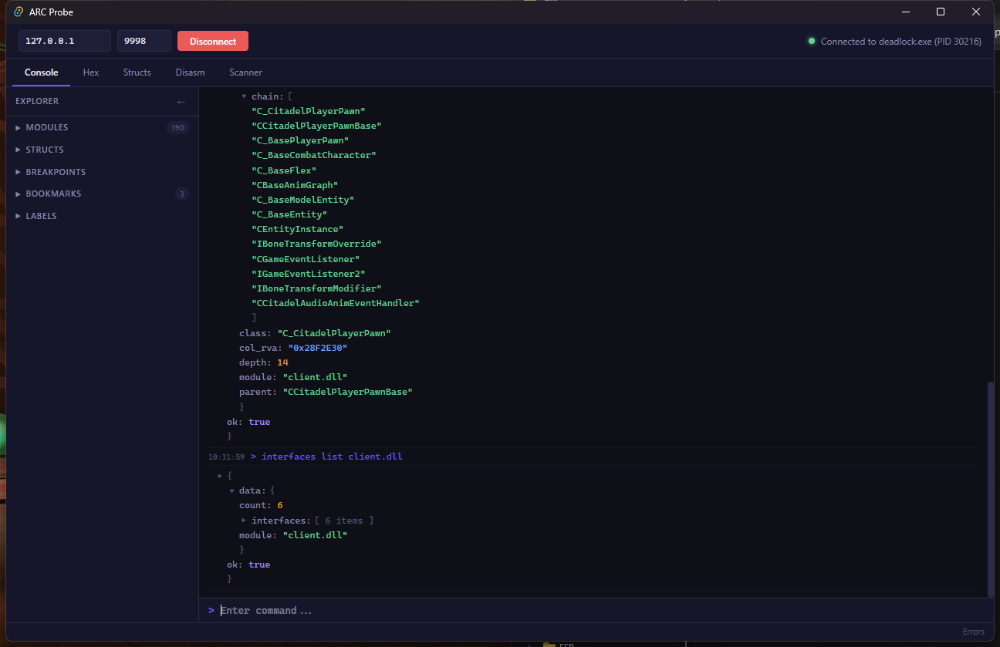

6 interfaces found:
- `Source2ClientUI001`
- `Source2ClientPrediction001`
- `ClientToolsInfo_001`
- `Source2Client002`
- `GameClientExports001`
- `Source2ClientConfig001`

These are the entry points that the engine uses to communicate with the client module.

## Part 4: Finding Global Pointers via Pattern Scanning

### The Power of Pattern Scanning + Schema Dumps

ARC Probe can scan the 60MB `client.dll` binary for byte patterns with wildcards. Combined with the schema dump from dezlock-dump, we can find the exact global variables that point to the entity system.

**From the schema dump** (`_globals.txt`):
```
client.dll::CGameEntitySystem = 0x31761D0 (pointer)
```

This tells us: at `client.dll + 0x31761D0`, there's a pointer to the `CGameEntitySystem` instance.

**Via pattern scanning** (agent discovers this automatically):
```bash
curl -s -X POST http://localhost:9996 -H "Content-Type: application/json" \
  -d '{"action":"probe","command":"pattern 48 8B 0D ?? ?? ?? ?? 48 85 C9 74 ?? 44 8B C2 client.dll --resolve 3"}'
```

The `--resolve 3` flag automatically resolves the RIP-relative address at byte offset 3, turning the pattern match into an absolute address for the global variable.

### Disassembly Confirms the Pattern

The code that accesses the entity system:

```asm
0x7FFDB6F99DF9  mov rcx, [0x7FFDBA0328B0]   ; load CGameEntitySystem*
0x7FFDB6F99E00  test rcx, rcx                 ; NULL check
0x7FFDB6F99E03  jz 0x7FFDB6F99E1F            ; skip if not in match
0x7FFDB6F99E05  mov r8d, edx                  ; entity index
0x7FFDB6F99E08  lea rdx, [rsp+0x30]           ; output buffer
0x7FFDB6F99E0D  call 0x7FFDB7EF6FE0           ; GetEntityByIndex
```

## Part 5: The Hex Viewer

### Inspecting Raw Memory

Navigate to `client.dll` base in the hex viewer to see the PE header:


The `MZ` signature at offset 0x00 confirms this is a valid PE module. The Data Inspector (right panel) shows every type interpretation of the selected bytes. Bookmarks (bottom right) provide quick navigation.

### Viewing Entity Memory

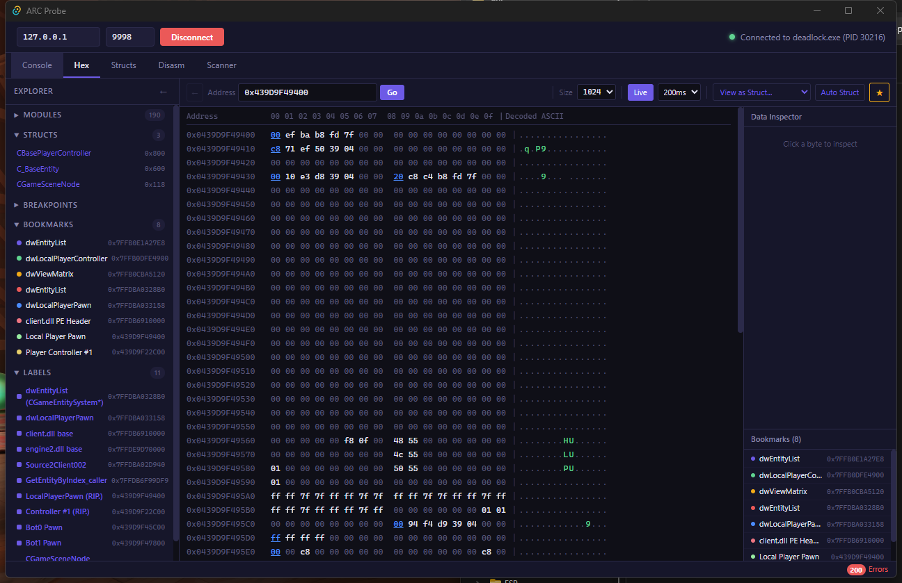

The hex view of a live player entity. Pointer values, health integers, team bytes — all visible in the raw hex with ASCII decode.

## Part 6: Disassembly

### Reading x86-64 Code

Navigate to the entity list access code in the disassembler:


The disassembler shows color-coded operands, resolved addresses, and labels in the sidebar. You can trace through function calls, identify globals via RIP-relative addressing, and understand the code flow.

## Part 7: The Agent Workflow — Building Structs from Schema + Live Memory

This is where the magic happens. Claude combines two data sources:
1. **Schema dump** from dezlock-dump — provides field names, types, and offsets for every networked class
2. **Live memory** via probe-shell.dll — provides real-time values at those offsets

### Step 9: Build C_BaseEntity via the Claude Bridge

The Claude Bridge (`localhost:9996`) lets the AI agent control the GUI programmatically. A single batch request creates an entire struct:

```bash
curl -s -X POST http://localhost:9996 -H "Content-Type: application/json" -d '{
  "action":"batch","actions":[
    {"action":"activity","status":"working","message":"Building C_BaseEntity from schema dump..."},
    {"action":"store","store":"struct","method":"createStruct","args":["C_BaseEntity","0x439D9F49400",1536]},
    {"action":"store","store":"struct","method":"addField","args":["C_BaseEntity",0,"pointer","vtable"]},
    {"action":"store","store":"struct","method":"addField","args":["C_BaseEntity",48,"pointer","m_CBodyComponent"]},
    {"action":"store","store":"struct","method":"addField","args":["C_BaseEntity",816,"pointer","m_pGameSceneNode"]},
    {"action":"store","store":"struct","method":"addField","args":["C_BaseEntity",848,"int32","m_iMaxHealth"]},
    {"action":"store","store":"struct","method":"addField","args":["C_BaseEntity",852,"int32","m_iHealth"]},
    {"action":"store","store":"struct","method":"addField","args":["C_BaseEntity",860,"uint8","m_lifeState"]},
    {"action":"store","store":"struct","method":"addField","args":["C_BaseEntity",960,"float","m_flSimulationTime"]},
    {"action":"store","store":"struct","method":"addField","args":["C_BaseEntity",1004,"float","m_flSpeed"]},
    {"action":"store","store":"struct","method":"addField","args":["C_BaseEntity",1011,"uint8","m_iTeamNum"]},
    {"action":"store","store":"struct","method":"addField","args":["C_BaseEntity",1024,"uint32","m_fFlags"]},
    {"action":"navigate","tab":"structs"},
    {"action":"activity","status":"idle","message":"C_BaseEntity ready"}
  ]
}'
```

### Step 10: Live Values Appear Instantly


With the **Live** toggle enabled (green button, top right), values update in real-time:

| Offset | Type | Field | Live Value |
|--------|------|-------|------------|
| 0x000 | ptr | vtable | `0x7FFDB8BAEF00` |
| 0x330 | ptr | m_pGameSceneNode | `0x439D8E31080` |
| 0x350 | int32 | m_iMaxHealth | `700` |
| 0x354 | int32 | m_iHealth | `700` |
| 0x35C | uint8 | m_lifeState | `0` (alive) |
| 0x3C0 | float | m_flSimulationTime | `3842.3125` |
| 0x3F3 | uint8 | m_iTeamNum | `2` (Amber) |

### Step 11: Recursive Pointer Definitions — CGameSceneNode

The `m_pGameSceneNode` pointer at offset 0x330 points to a `CGameSceneNode` struct. We create a separate struct definition for it:

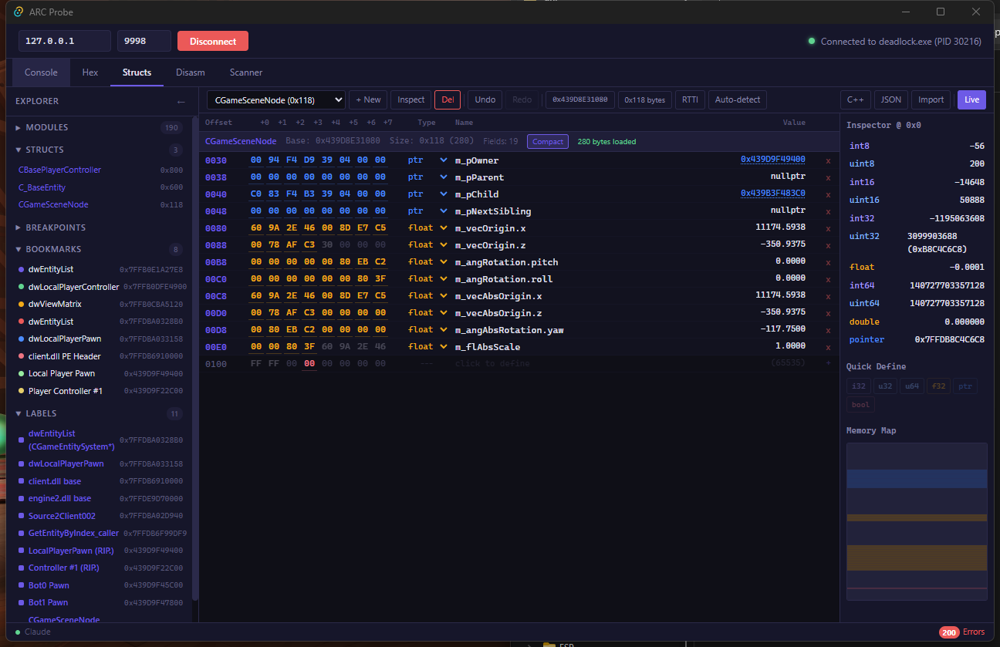

The CGameSceneNode contains the entity's world position, rotation, scale, and dormancy state:

| Offset | Type | Field | Description |
|--------|------|-------|-------------|
| 0x30 | ptr | m_pOwner | Back-pointer to owning entity |
| 0x38 | ptr | m_pParent | Parent node in scene hierarchy |
| 0x40 | ptr | m_pChild | First child node |
| 0x80 | float[3] | m_vecOrigin | Network origin |
| 0xB8 | float[3] | m_angRotation | Network rotation (pitch/yaw/roll) |
| 0xC4 | float | m_flScale | Scale factor |
| 0xC8 | float[3] | m_vecAbsOrigin | Absolute world position |
| 0xD4 | float[3] | m_angAbsRotation | Absolute rotation |
| 0x103 | bool | m_bDormant | 0=active, 1=dormant |

**Live position data:**
```
X: 11174.59, Y: -7409.62, Z: -350.94
Dormant: false (active)
```

### Step 11b: Pointer Drill-Down — CEntityIdentity

At the very top of C_BaseEntity (inherited from CEntityInstance), `m_pEntity` at offset 0x10 points to the entity's `CEntityIdentity` — the engine's internal bookkeeping for this entity in the entity system.

CEntityIdentity isn't in the schema dump (it's an engine-internal type), but we know its layout from the entity list structure: each identity is 0x70 bytes and lives in the chunked entity array.

The agent builds it from the known layout:

```bash
curl -s -X POST http://localhost:9996 -H "Content-Type: application/json" -d '{
  "action":"batch","actions":[
    {"action":"store","store":"struct","method":"createStruct","args":["CEntityIdentity","0x43950EF71C8",112]},
    {"action":"store","store":"struct","method":"addField","args":["CEntityIdentity",0,"pointer","m_pEntity"]},
    {"action":"store","store":"struct","method":"addField","args":["CEntityIdentity",8,"pointer","m_pClass"]},
    {"action":"store","store":"struct","method":"addField","args":["CEntityIdentity",16,"uint32","m_EntityHandle"]},
    {"action":"store","store":"struct","method":"addField","args":["CEntityIdentity",24,"pointer","m_pPrev"]},
    {"action":"store","store":"struct","method":"addField","args":["CEntityIdentity",32,"pointer","m_designerName"]},
    {"action":"store","store":"struct","method":"addField","args":["CEntityIdentity",40,"pointer","m_pNext"]},
    {"action":"store","store":"struct","method":"addField","args":["CEntityIdentity",48,"pointer","m_pPrevByClass"]},
    {"action":"store","store":"struct","method":"addField","args":["CEntityIdentity",56,"pointer","m_pNextByClass"]}
  ]
}'
```

Then link it to the parent:

```bash
curl -s -X POST http://localhost:9996 -H "Content-Type: application/json" \
  -d '{"action":"store","store":"struct","method":"setPointerTargetByOffset",
       "args":["C_BaseEntity", 16, "CEntityIdentity"]}'
```

Now clicking the `m_pEntity` pointer in C_BaseEntity expands the identity inline:

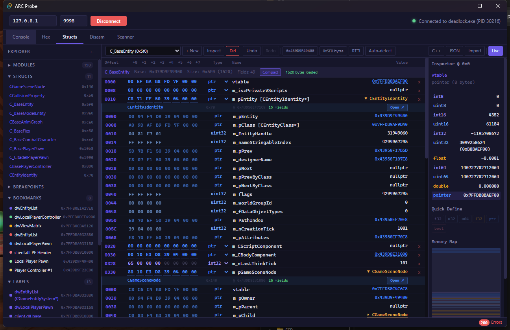

The identity reveals the entity system internals:

| Offset | Type | Field | Live Value |
|--------|------|-------|------------|
| 0x00 | ptr | m_pEntity | `0x439D9F49400` (back-pointer to pawn) |
| 0x08 | ptr | m_pClass | `0x7FFDB9AF9DA0` (CEntityClass metadata) |
| 0x10 | uint32 | m_EntityHandle | `31949060` (index 260) |
| 0x20 | ptr | m_designerName | -> `"player"` |
| 0x28 | ptr | m_pNext | linked list to next entity |
| 0x30 | ptr | m_pPrevByClass | linked list by class type |
| 0x38 | ptr | m_pNextByClass | linked list by class type |

This is the same 0x70-byte structure that makes up the chunked entity list — `m_pEntity` points back to the owning entity, `m_EntityHandle & 0x7FFF` gives the entity index, and `m_designerName` resolves to the entity's type string. The `m_pNext`/`m_pPrev` pointers form a doubly-linked list of all entities, while `m_pNextByClass`/`m_pPrevByClass` link entities of the same class.

### Step 12: Full Entity Layout

The complete C_BaseEntity layout with all 35+ fields:

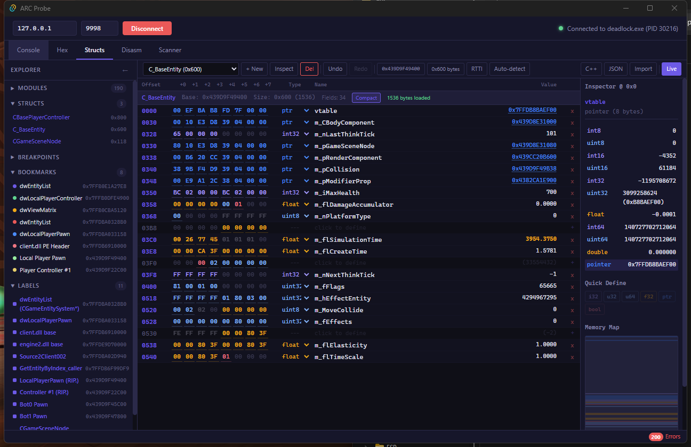

### Step 13: Controller -> Pawn Resolution

Player controllers reference their pawns via a `CHandle` at offset `0x6BC`:

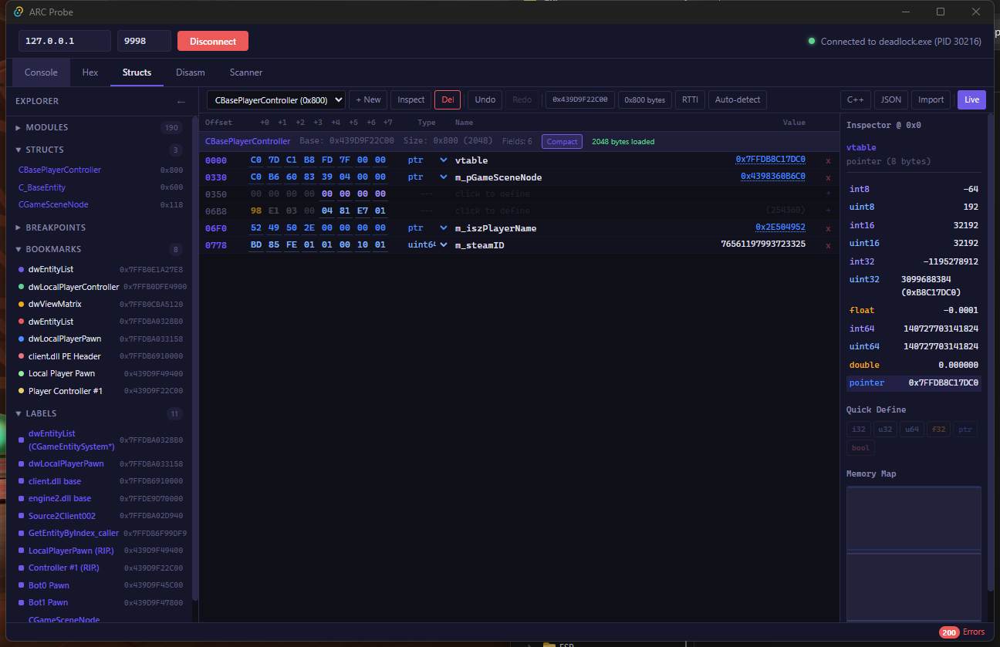

The controller struct reveals:
- `m_iszPlayerName` at 0x6F0 — the player's display name (char[128])
- `m_steamID` at 0x778 — the player's Steam ID
- `m_hPawn` at 0x6BC — handle to resolve to the pawn entity

**Handle resolution:** `pawn_index = m_hPawn & 0x7FFF`, then look up in the entity list.

## Part 8: Live Entity Scanning

### The Entity System

The entity scan discovered 3 players in a bot match:

```
=== Player Controllers ===

Controller #1: RIP.
  Address:  0x439D9F22C00
  Team:     Amber
  SteamID:  76561197993723325
  Pawn:     index=260, addr=0x439D9F49400
  Health:   700/700

Controller #2: Bot0
  Address:  0x439D9F23A00
  Team:     Amber
  SteamID:  0 (bot)
  Pawn:     index=256, addr=0x439D9F45C00
  Health:   800/800

Controller #3: Bot1
  Address:  0x439D9F24800
  Team:     Sapphire
  SteamID:  0 (bot)
  Pawn:     index=258, addr=0x439D9F47800
  Health:   770/770
```

### Entity List Structure

```
CGameEntitySystem (client.dll + 0x31761D0)
    |
    +-- entity_system + 0x10 --> first chunk pointer
         |
         +-- chunk[0]: 512 CEntityIdentity entries (0x70 bytes each)
              |
              +-- identity[0] + 0x00: entity pointer
              +-- identity[0] + 0x20: designer name string pointer
              +-- identity[1] + 0x00: entity pointer (at +0x70)
              +-- ...
```

**Index calculation:** `chunk = index >> 9`, `slot = index & 0x1FF`

## Part 9: Labels and Bookmarks

The sidebar shows all our annotated addresses:

**Bookmarks (quick navigation):**
- `dwEntityList` — entity system global
- `client.dll PE Header` — module base
- `Local Player Pawn` — the player entity
- `Player Controller #1` — the player controller

**Labels (address annotations):**
- `dwEntityList (CGameEntitySystem*)` at `0x7FFDBA0328B0`
- `dwLocalPlayerPawn` at `0x7FFDBA033158`
- `client.dll base` at `0x7FFDB6910000`
- `engine2.dll base` at `0x7FFDE9D70000`
- `LocalPlayerPawn (RIP.)` at `0x439D9F49400`
- `Controller #1 (RIP.)` at `0x439D9F22C00`
- `Bot0 Pawn` at `0x439D9F45C00`
- `Bot1 Pawn` at `0x439D9F47800`
- `CGameSceneNode (local pawn)` at `0x439D8E31080`

## Part 10: Beyond the GUI — CLI and Agent-Only Workflows

You don't need the GUI at all. Everything we did above can be done purely through the CLI or the Claude Bridge API.

### Using probe.exe (CLI)

```bash
# Health check
probe.exe ping

# Read player health
probe.exe "read_int 0x439D9F49400+0x354"

# Pattern scan for a function
probe.exe "pattern 48 8B 0D ?? ?? ?? ?? 48 85 C9 74 ?? 44 8B C2 client.dll --resolve 3"

# RTTI hierarchy
probe.exe "rtti hierarchy C_CitadelPlayerPawn client.dll"

# Disassemble
probe.exe "disasm 0x7FFDB6F99DF9 15"
```

### Using the Claude Bridge (HTTP API)

The bridge at `localhost:9996` accepts JSON commands:

```bash
# Send a probe command
curl -s -X POST http://localhost:9996 \
  -H "Content-Type: application/json" \
  -d '{"action":"probe","command":"read_int 0x439D9F49400+0x354"}'

# Create a struct
curl -s -X POST http://localhost:9996 \
  -H "Content-Type: application/json" \
  -d '{"action":"store","store":"struct","method":"createStruct","args":["MyStruct","0x1000",256]}'

# Set a label
curl -s -X POST http://localhost:9996 \
  -H "Content-Type: application/json" \
  -d '{"action":"store","store":"label","method":"setLabel","args":["0x7FFDB6910000","client.dll base"]}'

# Navigate the GUI
curl -s -X POST http://localhost:9996 \
  -H "Content-Type: application/json" \
  -d '{"action":"navigate","tab":"hex","address":"0x439D9F49400"}'
```

### Claude Code Plugin Skills

ARC Probe ships with a Claude Code plugin (`plugin/`) that provides skills for common tasks:

| Skill | Description |
|-------|-------------|
| `/probe:inject` | Inject probe-shell.dll into a target process |
| `/probe:analyze` | Deep analysis of a loaded module |
| `/probe:struct` | Map a struct from a memory address |
| `/probe:class` | Identify a C++ class via RTTI |
| `/probe:follow` | Navigate pointer chains |
| `/probe:trace` | Find what code reads/writes an address |
| `/probe:find` | Locate a function by behavior or strings |
| `/probe:rip` | Resolve RIP-relative addresses |
| `/probe:sig` | Generate byte signatures |
| `/probe:handbook` | Full RE techniques reference |

## Part 11: The Schema Dump — Your Offset Bible

The dezlock-dump tool generates comprehensive schema dumps:

```
dezlock-dump/build/bin/Release/schema-dump/deadlock/
  _globals.txt        # Every global singleton with RVA
  _entity-paths.txt   # Full field trees for every entity class
  _access-paths.txt   # Schema-expanded access chains
  client.txt          # All client.dll class fields with offsets
  server.txt          # All server.dll class fields
  signatures/         # Auto-generated vtable byte signatures
  hierarchy/          # Class inheritance trees
```

### Quick Lookups

```bash
# Find a field offset
grep "m_iHealth" client.txt
# -> C_BaseEntity.m_iHealth = 0x354 (int32, 4)

# Find a class layout
grep "^C_CitadelPlayerPawn\." client.txt | head -20

# Find all entity globals
grep "CGameEntitySystem" _globals.txt
# -> client.dll::CGameEntitySystem = 0x31761D0 (pointer)

# Find entity field trees
grep "m_vecAbsOrigin" _entity-paths.txt
```

## Part 12: Full Inheritance Chain — Every Class, Every Field

This is the showcase. We build the **entire** C_CitadelPlayerPawn inheritance chain as separate struct definitions — each class with its own fields from the schema dump — then wire them together with recursive pointer drill-down.

### The Hierarchy

```
C_CitadelPlayerPawn (size=0x1990, 32 fields)
  -> CCitadelPlayerPawnBase (size=0x10D0, no own fields)
    -> C_BasePlayerPawn (size=0x10B8, 25 fields)
      -> C_BaseCombatCharacter (size=0xEE0, 5 fields)
        -> C_BaseFlex (size=0xE58, 11 fields)
          -> CBaseAnimGraph (size=0xCA0, 14 fields)
            -> C_BaseModelEntity (size=0x9A0, 19 fields)
              -> C_BaseEntity (size=0x5F0, 48 fields)
                -> CEntityInstance (size=0x30, 4 fields)

Standalone structs:
  CEntityIdentity (size=0x70, 15 fields) — linked from C_BaseEntity.m_pEntity
  CGameSceneNode (size=0x140, 27 fields) — linked from C_BaseEntity.m_pGameSceneNode
  CCollisionProperty (size=0xB0, 18 fields) — linked from C_BaseEntity.m_pCollision
  CBasePlayerController (size=0x7E0, 4 fields) — separate entity type
```

### Building It All Programmatically

The agent builds all 10 structs in a single Python script via the Claude Bridge. Each class gets its own struct definition containing only the fields that class introduces (not inherited ones):

```python
# Phase 1: Build standalone referenced structs
batch([
    create_struct("CGameSceneNode", SCENE_NODE, 320),
    add("CGameSceneNode", 0x30, "pointer", "m_pOwner"),
    add("CGameSceneNode", 0x38, "pointer", "m_pParent"),
    add("CGameSceneNode", 0x40, "pointer", "m_pChild"),
    add("CGameSceneNode", 0xC8, "float", "m_vecAbsOrigin.x"),
    add("CGameSceneNode", 0xCC, "float", "m_vecAbsOrigin.y"),
    add("CGameSceneNode", 0xD0, "float", "m_vecAbsOrigin.z"),
    add("CGameSceneNode", 0x103, "bool", "m_bDormant"),
    # ... 27 fields total from schema dump
])

# Phase 2: Build the inheritance chain
batch([
    create_struct("C_BaseEntity", PAWN, 1520),
    add("C_BaseEntity", 0x330, "pointer", "m_pGameSceneNode"),
    add("C_BaseEntity", 0x340, "pointer", "m_pCollision"),
    add("C_BaseEntity", 0x350, "int32", "m_iMaxHealth"),
    add("C_BaseEntity", 0x354, "int32", "m_iHealth"),
    add("C_BaseEntity", 0x3C0, "float", "m_flSimulationTime"),
    add("C_BaseEntity", 0x3F3, "uint8", "m_iTeamNum"),
    # ... 48 fields total
])

# Phase 3: Wire up pointer drill-down
bridge(link_pointer("C_BaseEntity", 0x330, "CGameSceneNode"))
bridge(link_pointer("C_BaseEntity", 0x340, "CCollisionProperty"))
bridge(link_pointer("CGameSceneNode", 0x38, "CGameSceneNode"))  # self-referential tree
bridge(link_pointer("CGameSceneNode", 0x40, "CGameSceneNode"))
```

### The Struct Hierarchy in the GUI

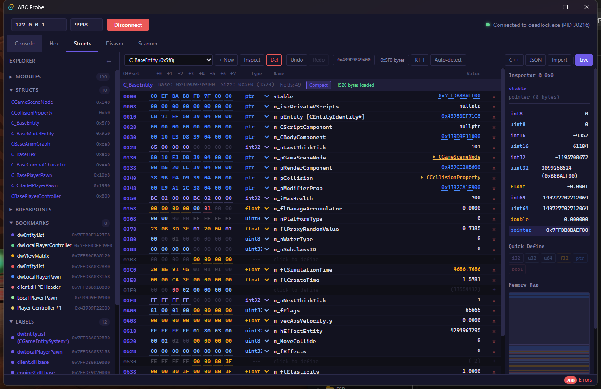

The sidebar lists all 10 struct definitions. The main panel shows C_BaseEntity with 48 fields — every field from the schema dump with live values updating in real-time.

### CGameSceneNode — Live World Position

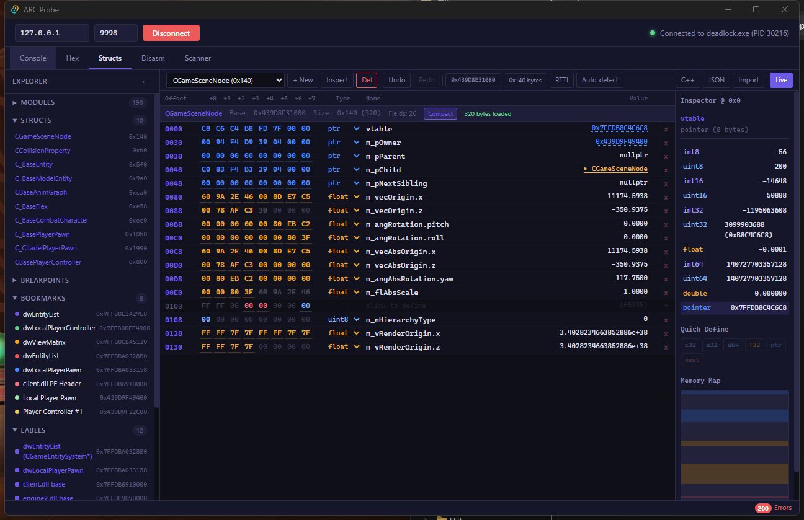

The scene node shows the player's world-space coordinates updating in real-time:
- `m_vecAbsOrigin`: (11174.6, -7409.6, -350.9)
- `m_bDormant`: false (entity is active)
- `m_pParent`, `m_pChild`, `m_pNextSibling`: scene graph tree pointers

### C_CitadelPlayerPawn — Hero-Specific Fields

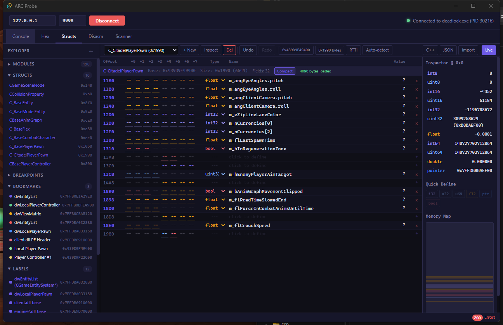

The deepest class in the hierarchy adds Deadlock-specific fields:
- `m_angEyeAngles` (0x11B0) — remote player aim direction
- `m_nLevel` (0x12D4) — hero level
- `m_nCurrencies` (0x12D8) — soul count
- `m_bInRegenerationZone`, `m_bInItemShopZone` — zone flags
- `m_flCrouchFraction`, `m_flCrouchSpeed` — movement state

### C_BasePlayerPawn — Services and View Angles

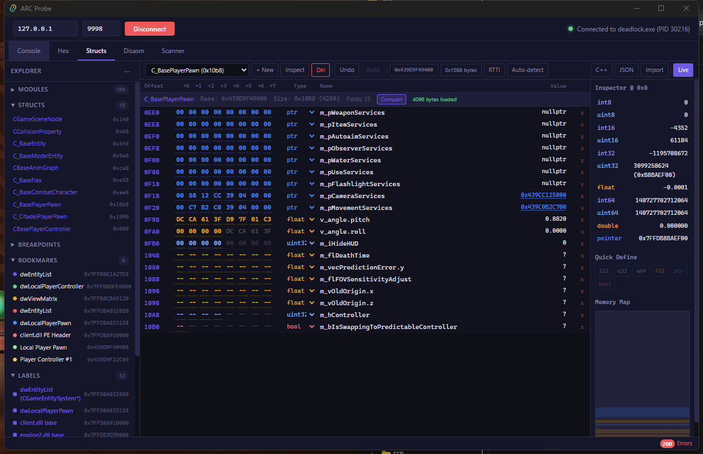

The base pawn class reveals the service pointer architecture:
- 9 service pointers (`m_pWeaponServices`, `m_pCameraServices`, `m_pMovementServices`, etc.)
- `v_angle` (0xF98) — local player view angles (pitch/yaw/roll)
- `m_hController` (0x10A8) — handle back to the player controller

### CCollisionProperty — Physics Bounds

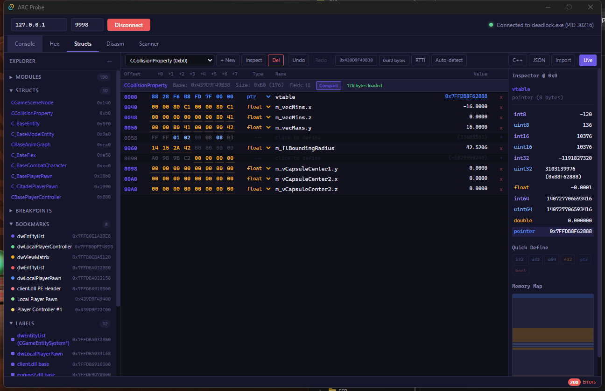

Collision bounds with live capsule data for the player hitbox:
- `m_vecMins/m_vecMaxs` — axis-aligned bounding box
- `m_vCapsuleCenter1/2` — capsule endpoints for the player model
- `m_flCapsuleRadius` — capsule radius
- `m_flBoundingRadius`: 42.52 units

## Part 13: Recursive Pointer Drill-Down

This is the key feature that makes struct exploration truly powerful. When a pointer field is linked to another struct definition, you can **expand it inline** — seeing the target struct's fields nested directly within the parent view.

### How It Works

The agent uses `setPointerTargetByOffset` to connect pointer fields to their target struct definitions:

```bash
# Link C_BaseEntity.m_pGameSceneNode -> CGameSceneNode struct
curl -s -X POST http://localhost:9996 -H "Content-Type: application/json" \
  -d '{"action":"store","store":"struct","method":"setPointerTargetByOffset",
       "args":["C_BaseEntity", 816, "CGameSceneNode"]}'

# Link C_BaseEntity.m_pCollision -> CCollisionProperty struct
curl -s -X POST http://localhost:9996 -H "Content-Type: application/json" \
  -d '{"action":"store","store":"struct","method":"setPointerTargetByOffset",
       "args":["C_BaseEntity", 832, "CCollisionProperty"]}'
```

Once linked, pointer fields render with an orange expand arrow (`▸ CGameSceneNode`) instead of just showing the raw address. Click to expand inline, click again to collapse.

### Inline Expansion in Action

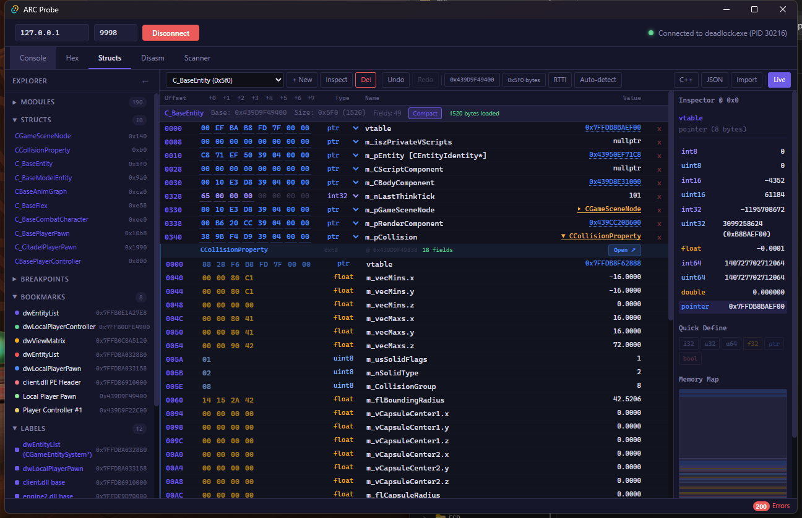

Here, `m_pCollision` is expanded inline within C_BaseEntity. The CCollisionProperty fields (`m_vecMins`, `m_vecMaxs`, `m_CollisionGroup`, `m_flBoundingRadius`, capsule data) are visible **nested inside** the parent struct view — all with live values. No navigation required.

### Self-Referential Trees

CGameSceneNode's tree pointers (`m_pParent`, `m_pChild`, `m_pNextSibling`) are linked back to CGameSceneNode itself. This enables recursive exploration of the scene graph hierarchy — expand a child node, then expand *its* children, as deep as you want.

### Navigation vs. Inline Expansion

There are two ways to follow a linked pointer:

1. **Inline expansion** (click the `▸` arrow) — expands the target struct's fields right within the current view. Best for quick inspection without losing context.

2. **followPointer** (programmatic) — pushes a nav breadcrumb, rebases the target struct to the pointer's actual address, and switches the active struct. Best for deep dives into a specific sub-object:

```bash
curl -s -X POST http://localhost:9996 -H "Content-Type: application/json" \
  -d '{"action":"store","store":"struct","method":"followPointer",
       "args":["C_BaseEntity", 816]}'
```

The nav breadcrumb trail (top of the struct view) lets you trace your path back. Click any breadcrumb to return to that point.

## Summary: What We Built

Starting from a blank slate, we:

1. **Connected** to a live Deadlock process (PID 30216, 190 modules)
2. **Discovered** client.dll (60MB, base `0x7FFDB6910000`)
3. **Found** `C_CitadelPlayerPawn` via RTTI (14-level inheritance, 39 related types)
4. **Mapped** Source 2 interfaces (6 in client.dll)
5. **Pattern scanned** for the CGameEntitySystem global
6. **Combined** schema dump offsets with live memory reads
7. **Built 10 struct definitions** covering the full inheritance chain:
   - `CEntityInstance` (4 fields) — entity system base
   - `C_BaseEntity` (48 fields) — health, team, velocity, flags
   - `C_BaseModelEntity` (19 fields) — render, collision, glow
   - `CBaseAnimGraph` (14 fields) — animation state
   - `C_BaseFlex` (11 fields) — facial flex weights
   - `C_BaseCombatCharacter` (5 fields) — wearables, foot attachments
   - `C_BasePlayerPawn` (25 fields) — services, view angles, controller
   - `C_CitadelPlayerPawn` (32 fields) — level, souls, abilities, eye angles
   - `CGameSceneNode` (27 fields) — position, rotation, scene graph
   - `CCollisionProperty` (18 fields) — bounds, capsule, collision groups
   - `CEntityIdentity` (15 fields) — entity handle, designer name, linked lists
   - `CBasePlayerController` (4 fields) — name, Steam ID, pawn handle
8. **Wired recursive pointer drill-down** between structs:
   - `C_BaseEntity.m_pEntity` -> `CEntityIdentity`
   - `C_BaseEntity.m_pGameSceneNode` -> `CGameSceneNode`
   - `C_BaseEntity.m_pCollision` -> `CCollisionProperty`
   - `CGameSceneNode.m_pParent/m_pChild/m_pNextSibling` -> `CGameSceneNode` (tree recursion)
9. **Scanned** live entities (3 players, world entity)
10. **Annotated** everything with labels and bookmarks
11. **Showed** it all works without the GUI too (CLI + Bridge API)

**218 fields** across 12 structs, all built programmatically by the AI agent through the Claude Bridge, with live values updating in real-time. The human and AI worked together — the agent drove the automation while the human opened inline expansions and verified the results visually.

That's agent-first design: the tool serves both human and AI equally, and they're more powerful together than either is alone.
